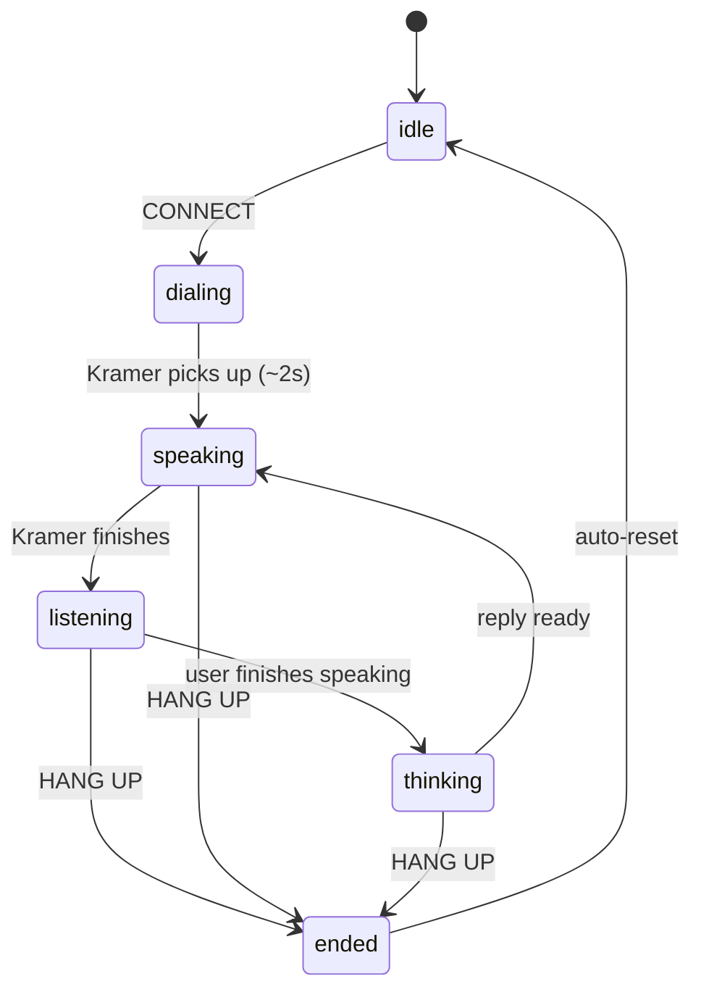

# Moviefilk Homepage — Y2K Shell Milestone

## Problem Frame

We're building **Moviefilk** for a hackathon whose pitch is "Y2K aesthetic + modern tech." The homepage is the entire demo surface — there is no second screen. Its job is to set the Moviefone/Kramer tone so strongly that the moment the user hears Kramer's voice, the bit lands. Today `src/routes/index.tsx` has a solid first pass (red marquee tickers, WordArt "555-FILK" logo, green CRT chat terminal, orange CONNECT button), but it leans **80s arcade / CRT** more than true **Y2K (1998–2003)** and the voice pipeline is wired to browser `SpeechRecognition` + `speechSynthesis` with a broken client-side Anthropic fetch — not the Cloudflare voice agent this hackathon is meant to showcase.

This milestone locks in the **visual shell** and the **call-flow state machine** so that when the Cloudflare voice agent comes in (already scoped in `docs/plans/2026-04-22-002-feat-cloudflare-voice-kramer-agent-plan.md`), swapping the browser stubs for `useVoiceAgent` is a delete-and-import, not a refactor.

## Requirements

**Visual shell (Y2K direction)**
- R1. Keep the core layout: red top/bottom marquee tickers, center phone-card, green CRT chat terminal inside the card, CONNECT/HANG UP button row, small disclaimer line.
- R2. Push the logo into **true Y2K WordArt**: chrome/silver gradient fill on "555-FILK", sharp black outline stroke, multi-layer dramatic drop-shadow (replace the current flat yellow fill). Keep the serif family.
- R3. Replace the flat orange CONNECT button with a **translucent iMac-candy beveled button** (glassy gradient — tangerine or Bondi blue — with highlight, inner shadow, and crisp rounded corners). TALK TO KRAMER and HANG UP should share the button system in matching candy colors (green / red).
- R4. Add **starburst badges** ("NEW!", "HOT!", "CLASSIC!") scattered over the marquee tickers and/or near the logo as decorative Y2K motifs.
- R5. Add an **animated lens-flare sweep** across the CONNECT button while idle, to signal "press me" without blinking.
- R6. Nudge the background away from pure near-black: a subtle **iridescent / holographic tile or dithered starfield** so the page reads "late-90s digital" rather than "arcade CRT". Dark enough that the CRT terminal still pops.
- R7. Keep the existing scanline + vignette overlays — they contribute to the pickup-up-the-phone-in-a-weird-apartment vibe.
- R8. Add a thin **"under construction" / "best viewed in Netscape 4.0"** strip above the bottom marquee as a cheeky era signature (one line, animated construction-bar GIF-equivalent rendered in CSS).

**Call-flow state machine**

- R9. The homepage runs one state machine with exactly these states: `idle`, `dialing`, `listening`, `thinking`, `speaking`, `ended`. These map 1:1 onto Cloudflare `useVoiceAgent`'s `status` values (`idle`, `listening`, `thinking`, `speaking`) plus the transient `dialing` animation and a terminal `ended` state.
- R10. Each state has a **distinct visible treatment**: status line copy, CONNECT vs TALK/HANG UP button set, mic/speaker affordance, and any animations (blink, pulse, shake).
- R11. `dialing` plays a visible "ringing" animation (shake + ring-count copy) for ~2s before transitioning to `speaking` (Kramer answers first).
- R12. `listening` shows live interim transcript in the status bar; `speaking` mutes the TALK button and shows "🔊 KRAMER SPEAKING"; `thinking` shows the three-dot bounce; `ended` resets to `idle` and wipes the transcript.
- R13. Add a **mute toggle** alongside TALK / HANG UP (planned for when the real hook ships, but present in the UI now so layout is stable).

**Voice integration shape (stub milestone)**
- R14. Refactor the current ad-hoc refs and effects into a single hook (e.g., `useKramerCall`) whose **return shape matches `useVoiceAgent`**: `{ status, transcript, interimTranscript, audioLevel, isMuted, startCall, endCall, toggleMute }`. Internally this milestone keeps browser `SpeechRecognition` + `speechSynthesis`, but the UI never reaches into those APIs directly.
- R15. Remove the client-side `fetch` to `api.anthropic.com` — it cannot work from the browser. For the stub milestone, replace it with either (a) a local mock responder that returns canned Kramer lines, or (b) a minimal server route that proxies a model. Either is acceptable; the point is that the UI no longer has a dead network call.
- R16. Expose the `audioLevel` value visually (even if the stub fakes it from a simple RMS or a timer): a small mic-level indicator inside the CRT terminal. This is cheap, reads as "live", and is already wired once the real hook lands.

**Content and copy**
- R17. Keep the existing Kramer `SYSTEM_PROMPT` content intact — it's good. Move the constant out of `src/routes/index.tsx` into a co-located module so it can be shared with the server-side agent later without churn.
- R18. The retro-movie ticker list (`RETRO_MOVIES`) should feel curated for the era the aesthetic evokes (late-90s blockbusters). Current list is on-brand; no change required, but flag it as a tunable.
- R19. Footer micro-copy ("555-MOVIEFILK · NOT AFFILIATED WITH THE REAL MOVIEFONE · OR NBC") stays — it's funny and signals the joke.

## Success Criteria

- A judge walking up to the page, **before pressing anything**, says "oh this is Moviefone / Y2K" within 3 seconds — the logo, marquee, candy CONNECT, and under-construction strip all carry that read.
- Pressing CONNECT feels like lifting a receiver: ringing animation → Kramer answers first → user can respond. No dead-air confusion.
- Swapping the stub `useKramerCall` for `useVoiceAgent` is a one-file change in `src/routes/index.tsx` (delete hook import, import from `@cloudflare/voice/react`) — zero UI component edits.
- No console errors and no network calls to third-party LLM APIs from the browser.

## Scope Boundaries

- **Out of scope this milestone:** the actual Cloudflare voice agent class, `withVoice` wiring, Workers AI bindings, ElevenLabs voice cloning, Durable Object migrations. That's what `docs/plans/2026-04-22-002-feat-cloudflare-voice-kramer-agent-plan.md` covers.
- **Out of scope:** additional routes, authentication, user history, multiple callers, phone-number input keypad, SMS, Twilio telephony.
- **Out of scope:** Kramer avatar image/Polaroid, pop-up IE browser-chrome wrapper, pixelated icon replacement for every emoji. All rejected as scope creep that doesn't move the demo.
- **Explicit non-goal:** "responsive design excellence." The demo is shown on a laptop or presenter screen. Mobile is fine if cheap, not a gate.

## Key Decisions

- **Aesthetic direction: polish the existing shell toward true Y2K** (chrome, candy, sparkle) rather than reframing as a Y2K desktop OS, a print-ad layout, or a minimal voice-first page. Rationale: the existing shell is 70% there; redoing the frame burns hackathon hours for marginal gain, and the CRT terminal inside a Y2K chrome frame is itself a period-accurate combo (think Winamp + Napster era).
- **Voice wiring: stub first, real hook later** — but mirror the `useVoiceAgent` API exactly. Rationale: the user prioritized UI/homepage for this milestone, and designing against the real hook's shape means the UI work is never thrown away.
- **Kramer voice quality is the #1 post-UI follow-up.** Rationale: the demo punchline is sound, not sight. Workers AI TTS (Deepgram Aura) is "good enough" as a default; an ElevenLabs Kramer voice clone is the stretch that will make the demo memorable. Flagged for the next milestone, not this one.
- **Mute button added now, wired later.** Rationale: layout stability. Cheaper to reserve the space than to squeeze it in after the shell is done.
- **Remove the dead Anthropic client fetch now.** Rationale: it's not working today and keeping it in makes the stub feel broken during demos of the UI milestone.

## Dependencies / Assumptions

- The existing Cloudflare plan (`docs/plans/2026-04-22-002-feat-cloudflare-voice-kramer-agent-plan.md`) is the authoritative source for voice-agent architecture; this document defers to it and does not duplicate its decisions.
- `@cloudflare/voice`, `@cloudflare/voice/react`, and `agents` are not yet in `package.json` — verified. The voice-agent plan handles installing them; this milestone does not need them.
- Assume the hackathon demo runs in a recent Chromium browser (SpeechRecognition works) on a laptop. We will not invest in Safari/Firefox STT fallbacks this milestone.

## Outstanding Questions

### Resolve Before Planning

_None — direction is locked and the scope is small enough to plan directly._

### Deferred to Planning

- [Affects R3, R5][Technical] Best implementation for the candy button + lens-flare — pure CSS with layered gradients and a `@keyframes` shimmer, or a small SVG filter? Either is fine; defer to implementer taste.
- [Affects R6][Technical] Pick a specific background treatment (iridescent tile vs dithered starfield vs subtle holographic SVG). Prototype two, pick the one that reads Y2K without fighting the CRT.
- [Affects R15][Technical] Stub responder: canned lines in the browser vs a tiny worker route. If the Cloudflare voice-agent plan ships in the same push, skip the stub responder entirely and wire straight to the agent.
- [Affects R14][Needs research] Confirm the exact return shape of `useVoiceAgent` matches the `useKramerCall` interface above (docs excerpt in `uploads/voice-0.md` suggests yes — verify during planning).

## Next Steps

`-> /ce:plan` for structured implementation planning of the homepage milestone. The voice-agent work continues in parallel under its existing plan.
