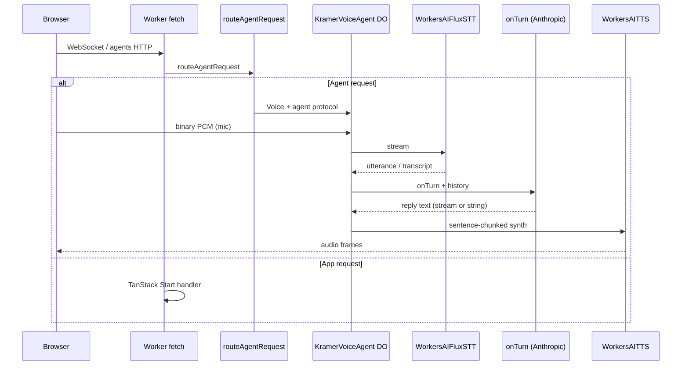

# feat: Cloudflare Voice agent for Kramer Moviefone

## Overview

Replace the browser-only voice stack (Web Speech API for STT, `speechSynthesis` for TTS, and a direct client `fetch` to Anthropic) with **Cloudflare Agents + `@cloudflare/voice`**: continuous STT from the mic over WebSocket, server-side **Kramer / Moviefone** replies via `onTurn`, and streaming TTS back to the speaker. The “custom endpoint” in product terms is the **voice-enabled Durable Object agent** (exposed under the standard Agents URL pattern), not a separate ad-hoc HTTP chat route—unless you add one later for debugging or health.

## Problem Frame

The home experience in `src/routes/index.tsx` is a playful “Kramer Moviefone” UI, but:

- Voice input depends on **browser speech recognition** (inconsistent across browsers).
- Spoken output uses **local `speechSynthesis`**, which does not sound like a consistent “character” across devices.
- The LLM call is initiated from the **client**; production should not depend on exposing model API keys or unauthenticated calls to Anthropic.

Moving the pipeline to **`withVoice`** aligns with [Cloudflare’s voice agent model](https://developers.cloudflare.com/agents/api-reference/voice/): mic PCM → Workers AI STT → your `onTurn` → TTS stream, with optional hooks (`afterTranscribe`, `beforeSynthesize`) and conversation persistence in SQLite on the Durable Object.

## Requirements Trace

- **R1.** User can speak from the browser and have speech recognized reliably for the Moviefone flow (turn detection handled by the STT model, not manual push-to-talk end-of-utterance hacks).
- **R2.** Assistant replies stay **in character** as Cosmo Kramer running Moviefone (same intent as the current `SYSTEM_PROMPT` in `src/routes/index.tsx`).
- **R3.** Replies are delivered as **audible TTS** to the user through the Voice pipeline (Workers AI TTS by default; optional third-party TTS if product requires a specific timbre).
- **R4.** **Secrets and model calls** run on the worker; no Anthropic (or other) API keys in client bundles.
- **R5.** The app remains deployable to **Cloudflare Workers** with TanStack Start (`wrangler.jsonc` + `@tanstack/react-start/server-entry`), composing **agent routing** with the existing app handler.

## Scope Boundaries

- **In scope:** `@cloudflare/voice` with `withVoice`, `WorkersAIFluxSTT`, `WorkersAITTS`, React `useVoiceAgent`, `wrangler` `ai` + Durable Object bindings, worker entry that calls `routeAgentRequest` then falls back to TanStack, refactoring the main route UI to drive calls from the hook.
- **Out of scope for v1:** Twilio/telephony, ElevenLabs (unless you explicitly add `@cloudflare/voice-elevenlabs` for a custom “voice” timbre), separate public REST “chat” API for third parties.
- **Clarification:** “Kramer’s voice” is split into **(a)** *writing style and personality* in `onTurn` (required) and **(b)** *acoustic voice* from TTS speaker choice or a third-party voice ID (tunable; default to Workers AI TTS with a chosen `speaker`).

## Context & Research

### Relevant Code and Patterns

- **Current Kramer prompt and flow:** `src/routes/index.tsx` — `SYSTEM_PROMPT`, `sendToKramer` (Anthropic `fetch`), `speak` / `startListening` / Web Speech types.
- **Worker config:** `wrangler.jsonc` — `main` currently points at `@tanstack/react-start/server-entry`; will need a **local entry module** that composes [agent routing with the Start handler](https://github.com/cloudflare/agents/issues/789) (see community pattern: `routeAgentRequest` first, then `handler.fetch`).
- **Reference implementation:** [tanstack-cloudflare-agent](https://github.com/mw10013/tanstack-cloudflare-agent) (wrangler + migrations) — use as a cross-check when wiring DO bindings.

### Institutional Learnings

- `docs/solutions/` is not present; no repo-local learnings to cite.

### External References

- [Voice agents (STT, TTS, hooks, `onTurn`, pipeline hooks)](https://developers.cloudflare.com/agents/api-reference/voice/)
- [Add agents to an existing project](https://developers.cloudflare.com/agents/getting-started/add-to-existing-project/) (`agents` package, `routeAgentRequest`, Vite `agents()` plugin, export agent from entry)
- [Workers AI TTS / STT built-ins](https://developers.cloudflare.com/agents/api-reference/voice/) (`WorkersAIFluxSTT`, `WorkersAITTS`, optional `speaker`)

## Key Technical Decisions

- **Voice stack:** `withVoice(Agent)` + `WorkersAIFluxSTT` + `WorkersAITTS` (see origin doc above). Rationale: first-party Workers AI, no extra vendor keys for the baseline, matches Cloudflare’s documented voice pipeline.
- **Worker entry:** Custom `src/server.ts` (name may vary) as `wrangler` `main` that (1) exports the voice agent class, (2) implements `fetch` with `await routeAgentRequest(request, env)` and falls through to the TanStack Start `server-entry` handler. Rationale: official Agents routing pattern; known TanStack + agents composition path.
- **Model / LLM:** Run Anthropic (or Workers AI text, if you prefer to consolidate) **inside `onTurn`** on the Durable Object using `context.messages` for history, with `context.signal` for interrupt/cancel when supported by your SDK usage. Rationale: keeps keys in secrets and matches streaming examples in the Voice docs.
- **“Kramer voice” (acoustic):** Start with `WorkersAITTS` options (`speaker`, optional model) and tune; if the product needs a specific celebrity timbre, that likely requires a **licensed custom voice** (e.g. ElevenLabs) and a follow-up—call that out in rollout rather than blocking the voice migration.
- **Vite / TypeScript:** Add `agents`’ Vite plugin and extend `tsconfig` per Cloudflare’s agents docs (decorators / project defaults). Rationale: required for `agents` + bundling Durable Object classes.

## Open Questions

### Resolved During Planning

- **“Custom endpoint”:** The user-visible “endpoint” is the **Agents WebSocket/HTTP surface** for the voice agent (class name → `/agents/...` routing per Agents docs), with `onTurn` implementing Kramer. No separate custom HTTP path is required for the same behavior.
- **Browser vs server STT:** Use Cloudflare continuous STT via `@cloudflare/voice` (not `webkitSpeechRecognition`).

### Deferred to Implementation

- **Exact `server-entry` import shape:** Confirm whether the Start handler is `default.fetch` or a single callable default for the current `@tanstack/react-start` version and mirror the [GitHub issue #789](https://github.com/cloudflare/agents/issues/789) pattern exactly after install.
- **Best Anthropic integration in DO:** Use HTTP `fetch` to Anthropic messages API vs an SDK; choose based on bundle size, streaming to `onTurn` return type (`AsyncIterable`/`ReadableStream` vs `string`), and Workers compatibility.
- **Initial “phone pickup” line:** Reproduce the current `handleConnect` → synthetic first message using **`onCallStart`** + `speak(connection, text)` and/or a seeded `saveMessage` so the first audible beat matches today’s UX.

## High-Level Technical Design

> *This illustrates the intended approach and is directional guidance for review, not implementation specification. The implementing agent should treat it as context, not code to reproduce.*

## Implementation Units

- [x] **Unit 1: Dependencies, Wrangler, and build wiring**

**Goal:** Add `agents`, `@cloudflare/voice`, and (if not already present) the AI/LLM client packages you will use in `onTurn`. Configure `wrangler.jsonc` with an `ai` binding, Durable Object binding for the voice agent class, and a **new migration** `new_sqlite_classes` for that class. Add the `agents` Vite plugin and `tsconfig` extension per Cloudflare. Run `wrangler types` and commit the generated env types. Point `main` at a new worker entry file (see Unit 2).

**Requirements:** R4, R5

**Dependencies:** None

**Files:**

- Modify: `package.json`
- Modify: `wrangler.jsonc`
- Modify: `vite.config.ts`
- Modify: `tsconfig.json` (or project tsconfig that Vite uses)
- Create: `worker-configuration.d.ts` or generated types (per `wrangler types` output — path as produced by the tool)

**Approach:**

- Follow [Add to existing project](https://developers.cloudflare.com/agents/getting-started/add-to-existing-project/) for bindings, migrations, and Vite/TS.
- Ensure `compatibility_flags` include what Agents expects (e.g. `nodejs_compat` already in repo).

**Patterns to follow:**

- Existing `wrangler.jsonc` and `vite.config.ts` plugin order (insert `agents()` in a way that keeps `@cloudflare/vite-plugin` + `tanstackStart()` working).

**Test scenarios:**

- Test expectation: none — configuration-only; confirm `wrangler dev` and `wrangler types` after edits, then validate agent wiring in Unit 3.

**Verification:**

- `wrangler dev` starts; TypeScript knows `env.AI` and the Durable Object binding; no migration errors on deploy to a dev worker.

---

- [x] **Unit 2: Kramer `withVoice` agent class (server behavior)**

**Goal:** Implement a `withVoice(Agent)` subclass with `transcriber` and `tts`, implement `onTurn` to generate Kramer / Moviefone text using the same **intent** as the current `SYSTEM_PROMPT` in `src/routes/index.tsx` (moved or imported from a shared module). Use Workers AI TTS with an explicit `speaker` choice documented in code comments for later tuning. Optionally implement `afterTranscribe` / `beforeSynthesize` for profanity or formatting cleanup. Store no secrets in source—read Anthropic (or other) API token from `env` secrets.

**Requirements:** R2, R3, R4

**Dependencies:** Unit 1

**Files:**

- Create: `src/agents/kramer-voice-agent.ts` (or equivalent path; keep agent code out of the route file)
- Create (optional): `src/agents/kramer-system-prompt.ts` — host `SYSTEM_PROMPT` string for reuse
- Test: `src/agents/kramer-voice-agent.test.ts` (or colocated `*.test.ts` next to prompt module)

**Approach:**

- Use `withVoice`, `WorkersAIFluxSTT`, `WorkersAITTS` from `@cloudflare/voice` per [Voice agents](https://developers.cloudflare.com/agents/api-reference/voice/).
- `onTurn`: pass conversation `context.messages` and the new `transcript` into the model; return streaming text if using the `ai` + `streamText` pattern, matching the doc’s `abortSignal: context.signal` guidance for interrupts.
- **Security:** Add `ANTHROPIC_API_KEY` (or chosen provider) as a Wrangler **secret**; never reference it in client code.

**Execution note:** If the existing route logic is the only spec for “good” Kramer lines, do a quick **characterization** read of `SYSTEM_PROMPT` and a sample exchange before deleting client-side `fetch` behavior, so the server prompt does not accidentally drift.

**Patterns to follow:**

- Cloudflare’s streaming `onTurn` example on the Voice docs; pipeline hooks for text cleanup only if needed.

**Test scenarios:**

- **Happy path:** `beforeSynthesize` (if implemented) leaves normal dialogue unchanged; or pure prompt module exports a non-empty string (smoke test).
- **Error path (deferred to integration):** If the model call fails, `onTurn` should yield a short in-character error string (e.g. “line went dead”)—mirror the `catch` copy in the current `sendToKramer` in `src/routes/index.tsx`.
- **Edge case:** Empty or noise transcript — use `afterTranscribe` to return `null` to skip, or handle short text, per product preference.

**Verification:**

- In isolation, module tests pass; in `wrangler dev`, a minimal `useVoiceAgent` or `VoiceClient` test page can connect (covered in Unit 3) and hear a Kramer-styled line.

---

- [x] **Unit 3: Worker entry: `routeAgentRequest` + TanStack Start handler**

**Goal:** Replace direct `main: "@tanstack/react-start/server-entry"` with a local entry that re-exports the Kramer voice agent and delegates `fetch` to `routeAgentRequest` first, then the Start server handler—matching the [TanStack + agents](https://github.com/cloudflare/agents/issues/789) pattern.

**Requirements:** R5

**Dependencies:** Unit 1, Unit 2

**Files:**

- Create: `src/server.ts` (or the filename you set in `wrangler.jsonc` `main`)
- Modify: `wrangler.jsonc` (`main` field)

**Approach:**

- `export { KramerVoiceAgent } from "./agents/...";`
- `export default { async fetch(request, env, ctx) { const r = await routeAgentRequest(request, env); if (r) return r; return (await import("@tanstack/react-start/server-entry")).default...fetch...(request) } }` — exact import style to be confirmed against the installed Start version.

**Patterns to follow:**

- Cloudflare’s “Add to existing project” `routeAgentRequest` example; TanStack issue thread for handler composition.

**Test scenarios:**

- **Integration — Happy path:** `GET`/`POST` to normal app routes still return the TanStack app; WebSocket/Agents paths hit the Durable Object (observed in dev tools / wrangler logs).
- **Error path:** Unknown path still returns the app 404, not a blank 500, when `routeAgentRequest` returns null.

**Verification:**

- App shell loads at `/`; voice client can reach the agent namespace without breaking SSR.

---

- [x] **Unit 4: Home route UI — `useVoiceAgent` and removal of browser voice APIs**

**Goal:** Rebuild the Moviefone UI in `src/routes/index.tsx` to use `useVoiceAgent` from `@cloudflare/voice/react` with `agent: "<YourAgentClassName>"` (string must match the exported class). Map existing status strings (“CONNECTED”, “LISTENING”, etc.) to `status`, `transcript`, `interimTranscript`, `startCall` / `endCall`, `toggleMute`, and errors. Remove `SpeechRecognition` and `speechSynthesis` from the default path. Keep the visual design (ticker, phone chrome) as much as possible.

**Requirements:** R1, R2, R3

**Dependencies:** Unit 3

**Files:**

- Modify: `src/routes/index.tsx`
- Test: `src/routes/index.test.tsx` (React Testing Library + mocked `useVoiceAgent`)

**Approach:**

- `startCall` replaces the “lift receiver / connect” flow; `endCall` on hang up.
- Display `transcript` (role + text) from the hook instead of only local `messages` state, or merge into the existing `MessageType` list in a thin adapter—avoid duplicate sources of truth.
- Remove direct Anthropic `fetch` from the browser entirely.

**Patterns to follow:**

- `@cloudflare/voice/react` hook API from the Voice docs; existing component structure and `RETRO_MOVIES` ticker.

**Test scenarios:**

- **Happy path (mocked):** When the mocked hook returns `status === "listening"` and a user transcript line, the UI shows the same affordances you expect (text visible, no crash).
- **Error path:** When `useVoiceAgent` provides `error`, the UI shows “line trouble” or equivalent copy consistent with the old `catch` branch.
- **Edge case:** `interimTranscript` only — UI shows italic partial line without duplicating final text (align with prior interim UX if any).

**Verification:**

- Manual: connect, speak, hear TTS, interrupt during playback (per `@cloudflare/voice` interrupt behavior) if the UI exposes unmute; hang up ends the session cleanly.

**Test expectation for pure UI:** If the team prefers not to add RTL yet, use `Test expectation: none -- manual QA only` only if you add a checklist in Verification; prefer at least one mocked hook test for regression safety.

---

## System-Wide Impact

- **Interaction graph:** New WebSocket/Agents traffic; TanStack `fetch` runs only when agent routing does not match. Durable Object SQLite stores conversation history for `withVoice`.
- **Error propagation:** LLM and TTS failures should surface in-character in text/audio where possible; client shows `error` from the hook.
- **State lifecycle risks:** One active “call” at a time unless you add multi-tab handling; `beforeCallStart` can enforce single-speaker if required (Voice docs pattern).
- **API surface parity:** No change to public HTTP API unless you add a debug route; Anthropic is server-only.
- **Integration coverage:** `routeAgentRequest` + Start co-existence and a full voice call (mic permission, audio in/out) require manual or E2E validation; unit tests cover UI and pure modules.
- **Unchanged invariants:** Non-voice app routes and static assets should behave as before when agent routing returns null.

## Risks & Dependencies

| Risk | Mitigation |
|------|------------|
| `@cloudflare/voice` is **beta** | Document in README; pin versions; watch Cloudflare release notes. |
| TanStack Start + DO header quirks (see [agents#789](https://github.com/cloudflare/agents/issues/789)) | Use documented `routeAgentRequest` order; if Miniflare header errors reappear, capture a minimal repro and open/track upstream. |
| Mic / HTTPS / permissions | Document that voice requires secure context; surface hook `error` in UI. |
| TTS “Kramer” timbre not achievable on Workers AI alone | Set expectations: personality via LLM; timbre via `WorkersAITTS` `speaker` or a later ElevenLabs integration. |
| Secret management | `wrangler secret put ANTHROPIC_API_KEY` (or chosen provider); never embed in Vite client env. |

## Documentation / Operational Notes

- **README / deploy:** Document new secrets, `wrangler` migrations, and that the first deploy after adding DOs must run migrations.
- **Observability:** Use Worker logs for `onTurn` failures; optional metrics hook from Voice `metrics` on the client for tuning latency.

## Sources & References

- **Origin document:** N/A (no matching `docs/brainstorms/*-requirements.md`; request + [Voice agents](https://developers.cloudflare.com/agents/api-reference/voice/))
- Related code: `src/routes/index.tsx`, `wrangler.jsonc`, `vite.config.ts`
- External: [Add agents to existing project](https://developers.cloudflare.com/agents/getting-started/add-to-existing-project/), [TanStack on Workers](https://developers.cloudflare.com/workers/framework-guides/web-apps/tanstack), [agents issue #789](https://github.com/cloudflare/agents/issues/789), [example repo](https://github.com/mw10013/tanstack-cloudflare-agent)
