# feat: Browser microphone permission flow for Kramer voice call

## Overview

The Moviefilk home route already drives the voice pipeline through `useVoiceAgent` from `@cloudflare/voice/react`. Under the hood, `VoiceClient.#startMic` calls `navigator.mediaDevices.getUserMedia(...)`, but when that call fails it only emits a single generic error string ("Microphone access denied. Please allow microphone access and try again.") and we render the same `LINE TROUBLE — TRY AGAIN` copy regardless of cause. This plan adds a proper **browser microphone permission flow** in front of the voice call: detect capability, detect prior permission state via the Permissions API, request mic access from a real user gesture, classify errors (denied / no-device / in-use / insecure-context / unsupported), and surface a recovery UX so users know exactly why the mic is not working and what to do.

## Problem Frame

Users tap CONNECT, the UI plays the "ringing" animation, and then — if the browser later prompts for mic access and the user denies it, if no mic is present, if Safari blocks because the tab isn't in a secure context, or if the site is opened in an in-app webview that can't capture audio — the only feedback they get is a tiny blinking "LINE TROUBLE — TRY AGAIN" line. There is no way to:

- Distinguish "I haven't asked yet" from "the browser remembers you denied this".
- Recover after permanent denial without opening browser settings, which the UI doesn't explain.
- Handle iOS Safari's strict user-gesture requirements — the existing `setTimeout(2000)` inside `handleConnect` separates the tap from both `getUserMedia` and `AudioContext` unlock, which can cause silent mic failures on iOS.
- See any guidance when the page is served over plain HTTP/non-secure context (e.g., preview deploys, Miniflare tunnels) where `getUserMedia` is disabled by the browser.

The feature is scoped to the **client UX and preflight**, not the server voice stack.

## Requirements Trace

- **R1.** When the user taps CONNECT, we actively request microphone permission using `navigator.mediaDevices.getUserMedia` before starting the ringing animation, so the browser's native mic prompt appears at a deterministic moment and fires from the user gesture.
- **R2.** Before the CONNECT affordance is usable, we detect and communicate unrecoverable capability gaps: insecure context (not HTTPS/localhost), no `navigator.mediaDevices.getUserMedia` support, no audio input device.
- **R3.** When permission is already granted (Permissions API), the connect flow proceeds without re-prompting. When it is `'prompt'`, we let the browser prompt. When it is `'denied'`, we show a recovery panel with clear next steps instead of dialing.
- **R4.** Permission errors are classified — `denied`, `no-device`, `in-use`, `insecure-context`, `unsupported`, `unknown` — and each maps to a distinct in-UI message and (where applicable) a retry affordance.
- **R5.** The fix restores the user-gesture chain iOS Safari requires: mic request happens synchronously on tap, `AudioContext.resume()` runs in the same gesture, and the 2s ringing animation no longer gates the browser-level permission prompt.
- **R6.** When the browser later revokes or changes the permission (e.g., user flips it in site settings while the tab is open), the UI reflects the new state via the `PermissionStatus` change event without a reload.

## Scope Boundaries

- **In scope:** Client-side `src/routes/index.tsx` and new `src/lib/mic-permissions.ts` / `src/hooks/useMicPermission.ts` utilities. Preflight probe, Permissions API integration, error taxonomy, UX copy for each state, AudioContext unlock on user gesture.
- **Out of scope:**
  - Changing the `@cloudflare/voice` library's own error handling or patching `VoiceClient.#startMic`.
  - Server-side changes (`KramerVoiceAgent`, `src/server.ts`, worker config, TTS/STT plumbing).
  - Device-picker UI (choosing between multiple mics via `enumerateDevices`). The default mic is sufficient for v1.
  - Native browser permission UI theming — we only control our own in-page chrome.
  - Mobile app / PWA `installprompt` flows.

## Context & Research

### Relevant Code and Patterns

- `src/routes/index.tsx` — current `handleConnect`, `handleHangUp`, `isConnected`/`voiceStatus` derivation, status string state machine, ticker/phone chrome. All UX copy and state driven here.
- `node_modules/@cloudflare/voice/dist/voice-client.js` (`#startMic`) — shows that the library calls `getUserMedia({audio: {sampleRate, channelCount, echoCancellation, noiseSuppression, autoGainControl}})` with no explicit `deviceId`. Any preflight probe we do should request compatible constraints so our probe doesn't "succeed" while the library's stricter call fails — realistically, probing with `{audio: true}` is sufficient because the library only adds optional hints (`ideal`).
- `node_modules/@cloudflare/voice/dist/voice-react.d.ts` — the `useVoiceAgent` surface we already consume; `error: string | null` is the only failure channel from the library today.
- `wrangler.jsonc` — confirms deploy target (Cloudflare Workers, custom domain `movieflik.biz`). Production is HTTPS; local dev via Vite is `http://localhost`, which is treated as a secure context by Chromium/Safari for `getUserMedia`.
- Existing plan `docs/plans/2026-04-22-002-feat-cloudflare-voice-kramer-agent-plan.md` already flagged "Mic / HTTPS / permissions" as a risk with the mitigation "surface hook `error` in UI" — this plan delivers that mitigation properly.

### Institutional Learnings

- `docs/solutions/` does not exist in this repo; no institutional learnings to cite.

### External References

- [MDN: `MediaDevices.getUserMedia` — exceptions list](https://developer.mozilla.org/en-US/docs/Web/API/MediaDevices/getUserMedia#exceptions) — authoritative mapping of error `name`s: `NotAllowedError`, `NotFoundError`, `NotReadableError`, `OverconstrainedError`, `SecurityError`, `AbortError`, `TypeError`.
- [MDN: `Permissions.query()` with `{ name: 'microphone' }`](https://developer.mozilla.org/en-US/docs/Web/API/Permissions/query) — notes Firefox historically did not support the `microphone` name; feature-detect and fall back to `unsupported`.
- [MDN: `Window.isSecureContext`](https://developer.mozilla.org/en-US/docs/Web/API/Window/isSecureContext) — what we use to gate preflight.
- [WebKit blog / Apple docs on iOS Safari audio](https://webkit.org/blog/6784/new-video-policies-for-ios/) and common guidance: `AudioContext.resume()` must be called in the same user-gesture handler as the tap; `getUserMedia` itself also requires a user activation on iOS.

## Key Technical Decisions

- **Preflight probe via `getUserMedia({audio: true})`, then immediately stop tracks**: rather than relying solely on `navigator.permissions.query`, which isn't universally supported for `microphone` and can't tell us about missing/busy devices. The probe runs *before* the 2s ringing animation so the browser prompt appears when the user expects it, and any failure lands us in a classified error state instead of a generic "LINE TROUBLE".
- **Wrap `useVoiceAgent` rather than fork it**: we keep using the library's `startCall`, but only call it after our preflight succeeds. This avoids any patching of `node_modules` and keeps us compatible with future `@cloudflare/voice` upgrades.
- **Permissions API as an *optimization*, not the source of truth**: use it to (a) skip the re-prompt experience when `'granted'`, (b) show the recovery panel proactively when `'denied'`, and (c) subscribe to `change` events for live updates. When `Permissions.query` is unavailable or throws for `microphone`, we fall back cleanly to "query on demand via probe".
- **Error taxonomy** mapped from `DOMException.name`:
  - `NotAllowedError` / `SecurityError` → `denied`
  - `NotFoundError` / `OverconstrainedError` (audio-only) → `no-device`
  - `NotReadableError` / `AbortError` → `in-use`
  - `TypeError` on `getUserMedia` (e.g., constraints invalid) → `unknown`
  - Missing `navigator.mediaDevices?.getUserMedia` → `unsupported`
  - `!window.isSecureContext` → `insecure-context`
- **User-gesture repair**: the mic request and `AudioContext.resume()` both run synchronously on the CONNECT tap. The cosmetic 2-second "ringing" animation runs *after* preflight resolves (post-prompt) and before `startCall`, so the gesture-sensitive work is no longer on the wrong side of `setTimeout`.
- **No device picker in v1**: we rely on the system default mic; adding `enumerateDevices`/selection UI would double the surface area and is not requested.
- **Hook-based, not context-based**: the permission state and request handler live in a small `useMicPermission` hook consumed directly by `src/routes/index.tsx`. No provider wrapping needed since only the home route currently needs it.

## Open Questions

### Resolved During Planning

- **Should we preflight with `getUserMedia` or only check `navigator.permissions`?** Both. Permissions API is informational; the probe is authoritative and also catches no-device / in-use cases the Permissions API doesn't model.
- **Should we suppress the 2s ringing animation when permission is already granted?** No — the retro phone feel is core UX. We keep the animation, but only after preflight resolves successfully. When already `'granted'`, preflight resolves nearly instantly, so ringing happens with no perceptible interruption.
- **Where does AudioContext unlock belong?** In the same tap handler that kicks off the preflight, because iOS requires both mic access and AudioContext resume to originate from a user activation. We do not need to create an AudioContext ourselves — the library creates one lazily — but we can "touch" one in the gesture by invoking a no-op resume path if feasible. If that proves library-internal, we accept the risk and validate on iOS during implementation; this is a deferred investigation, not a blocker for v1 on desktop.

### Deferred to Implementation

- **Exact AudioContext unlock strategy**: whether to construct a throwaway `AudioContext` in the tap handler purely to force user-activation bookkeeping, or trust that the library's first `ctx.audioWorklet.addModule` call within the same gesture (via `startCall`) is enough on iOS. Resolve by manually testing on iOS Safari during Unit 3 and pick the minimum approach that works.
- **Copy polish for recovery panel**: the initial strings in this plan are functional; final wording ("Click the 🔒 in your address bar...", etc.) can be refined during implementation once we see the states in place.
- **Firefox's `microphone` Permissions API support**: feature-detect at runtime; if `Permissions.query({name:'microphone'})` rejects, treat as `unsupported` and fall back to probe-only flow.

## High-Level Technical Design

> *This illustrates the intended approach and is directional guidance for review, not implementation specification. The implementing agent should treat it as context, not code to reproduce.*

```mermaid
stateDiagram-v2
  [*] --> Checking: mount

  Checking --> Unsupported: no getUserMedia / insecure context
  Checking --> Denied: Permissions API -> 'denied'
  Checking --> Granted: Permissions API -> 'granted'
  Checking --> Prompt: Permissions API -> 'prompt' or unsupported

  Prompt --> Requesting: user taps CONNECT
  Granted --> Requesting: user taps CONNECT (probe still runs; ~instant)

  Requesting --> Granted: probe succeeds
  Requesting --> Denied: NotAllowedError / SecurityError
  Requesting --> NoDevice: NotFoundError / OverconstrainedError
  Requesting --> InUse: NotReadableError / AbortError
  Requesting --> Unknown: other

  Granted --> Ringing: preflight ok -> begin 2s ringing
  Ringing --> InCall: startCall()

  Denied --> Prompt: user re-grants in browser settings (permissionchange)
  NoDevice --> Prompt: devicechange detected (optional)
```

Each non-`Ringing`/`InCall` state drives UI copy and affordances; the `permissionchange` transition is live via `PermissionStatus.onchange`.

## Implementation Units

- [ ] **Unit 1: Microphone capability and permission utility module**

**Goal:** Add a small, pure-ish module that encapsulates all browser-API concerns: secure-context check, `getUserMedia` support detection, Permissions API query (with fallback), one-shot permission probe that immediately releases tracks, and error classification. This module has no React dependency and is trivially unit-testable.

**Requirements:** R2, R4

**Dependencies:** None

**Files:**
- Create: `src/lib/mic-permissions.ts`
- Test: `src/lib/mic-permissions.test.ts`

**Approach:**
- Export a `MicPermissionStateType` union: `'granted' | 'prompt' | 'denied' | 'no-device' | 'in-use' | 'insecure-context' | 'unsupported' | 'unknown'`.
- Export a small `MicProbeResultType`: `{ ok: true } | { ok: false; state: Exclude<MicPermissionStateType, 'granted' | 'prompt'> }`.
- Export `isMicSupported()`: returns `false` when `!window.isSecureContext` or `!navigator.mediaDevices?.getUserMedia`, plus a richer `detectMicEnvironment()` returning `'insecure-context' | 'unsupported' | 'ok'`.
- Export `queryMicPermission(): Promise<MicPermissionStateType | null>` — wraps `navigator.permissions?.query({ name: 'microphone' })`; returns `null` when the API or descriptor is unsupported (caller falls back).
- Export `probeMicAccess(): Promise<MicProbeResultType>` — calls `getUserMedia({ audio: true })`, stops all tracks on success, classifies errors by `DOMException.name` on failure. Uses `{ audio: true }` (not the library's richer constraints) so the probe is a strict superset of the library's requirements.
- Keep the error-name mapping in a single internal helper so tests can assert it once.

**Patterns to follow:**
- No direct React/DOM coupling (module should work in tests with mocked `navigator`/`window`).
- Match project convention: `Type` suffix for exported types/interfaces; `export default function` is not applicable (this file exports utility functions, not a component).

**Test scenarios:**
- **Happy path — probe grants:** mocked `navigator.mediaDevices.getUserMedia` resolves with a stream whose tracks expose a `stop` spy; assert probe returns `{ ok: true }` and that every track's `stop()` was invoked.
- **Error path — denied:** `getUserMedia` rejects with `DOMException('...', 'NotAllowedError')`; assert probe returns `{ ok: false, state: 'denied' }`.
- **Error path — security error:** rejects with `name: 'SecurityError'`; maps to `'denied'`.
- **Error path — no device:** rejects with `name: 'NotFoundError'`; maps to `'no-device'`. Repeat with `OverconstrainedError` → same state.
- **Error path — in-use:** rejects with `name: 'NotReadableError'`; maps to `'in-use'`. Repeat with `AbortError` → same state.
- **Error path — unknown:** rejects with an unrelated name like `'TypeError'`; maps to `'unknown'`.
- **Edge case — env detection:** `window.isSecureContext === false` → `detectMicEnvironment()` returns `'insecure-context'`. `navigator.mediaDevices` undefined → returns `'unsupported'`. Both present → returns `'ok'`.
- **Edge case — Permissions API unavailable:** `navigator.permissions` undefined → `queryMicPermission()` resolves to `null`. `permissions.query` rejects (e.g., Firefox historical `microphone` descriptor) → also resolves to `null`.
- **Edge case — Permissions API returns granted/denied/prompt:** each is passed through unchanged.

**Verification:**
- All test scenarios pass with mocked browser globals; module has no references to React; TypeScript builds cleanly under the project's strict config (no `as any`, no type assertions).

---

- [ ] **Unit 2: `useMicPermission` React hook**

**Goal:** Bridge the utility module into React, exposing a stable hook contract that `src/routes/index.tsx` can consume: current state, a `request()` action bound to a user gesture, and a `lastErrorReason` for telemetry/debug. Subscribe to `permissionchange` events so the UI updates live when the user toggles the permission in browser settings.

**Requirements:** R1, R3, R4, R6

**Dependencies:** Unit 1

**Files:**
- Create: `src/hooks/useMicPermission.ts`
- Test: `src/hooks/useMicPermission.test.tsx`

**Approach:**
- Hook signature: `useMicPermission(): UseMicPermissionReturnType` where the return type exposes `{ state: MicPermissionStateType, lastErrorReason: string | null, request: () => Promise<MicPermissionStateType> }`.
- On mount: compute initial state via `detectMicEnvironment()`; if `'ok'`, call `queryMicPermission()` and set state to its result (or `'prompt'` when it returns `null`).
- If `queryMicPermission()` returns a live `PermissionStatus`, attach an `onchange` listener to mirror updates into state, and clean up on unmount. Because our utility currently returns only the string state, extend it to return both the state and an optional `PermissionStatus` when available (either augment `queryMicPermission` or add a sibling `subscribeMicPermission`). Prefer the sibling helper to keep `queryMicPermission` return type simple.
- `request()`: runs `probeMicAccess()` and sets `state` to `'granted'` or the returned failure state; returns the resulting state so callers can branch synchronously.
- Guard against setting state after unmount using a `mountedRef`.
- All references follow the user rule: variable names ≥ 3 letters; types suffixed with `Type`.

**Patterns to follow:**
- Standard "subscribe on mount, cleanup on unmount" React pattern.
- No context/provider — consumed directly by the home route.

**Test scenarios:**
- **Happy path — initial granted:** mock `queryMicPermission` → `'granted'`; hook's initial state settles to `'granted'` after effect.
- **Happy path — initial prompt then granted:** initial `'prompt'`; calling `request()` with `probeMicAccess` resolving `{ok: true}` transitions state to `'granted'` and the returned promise resolves to `'granted'`.
- **Edge case — insecure context on mount:** `detectMicEnvironment` returns `'insecure-context'`; hook state is `'insecure-context'` and `request()` short-circuits to the same state without invoking `getUserMedia` (spy asserts not called).
- **Edge case — unsupported browser on mount:** `detectMicEnvironment` returns `'unsupported'`; state is `'unsupported'`; `request()` short-circuits.
- **Error path — request denied:** `probeMicAccess` resolves `{ok: false, state: 'denied'}`; state transitions to `'denied'` and `lastErrorReason` is set to a human-readable string.
- **Integration — permissionchange event:** with a mock `PermissionStatus` that exposes `.state` and an `onchange` setter, firing a change from `'prompt'` to `'denied'` updates the hook state without re-calling `request()`.
- **Integration — unmount cleanup:** after unmount, firing a subsequent `permissionchange` does not trigger a React state-update warning (verify via React test utilities).

**Verification:**
- All hook tests pass with React Testing Library (`renderHook` or component wrapper); no `act()` warnings; cleanup verified.

---

- [ ] **Unit 3: Wire preflight into `handleConnect` and repair the user-gesture chain**

**Goal:** Update `src/routes/index.tsx` so the CONNECT tap first runs `request()` from `useMicPermission`, and only begins the 2s ringing animation + `startCall()` when the probe returns `'granted'`. Ensure any user-gesture-dependent work (AudioContext unlock, if we add one) happens synchronously in the tap handler rather than after `setTimeout`.

**Requirements:** R1, R3, R5

**Dependencies:** Unit 2

**Files:**
- Modify: `src/routes/index.tsx`

**Approach:**
- Import and call `useMicPermission()` at the top of the component alongside `useVoiceAgent()`.
- Replace `handleConnect` logic: `(1)` if `micState` is terminal-bad (`'insecure-context'`, `'unsupported'`, `'no-device'`, `'denied'`), no-op — the UI in Unit 4 already shows the recovery panel; `(2)` otherwise call `await micRequest()`; `(3)` on `'granted'`, set `phoneRinging=true`, schedule `setTimeout(2000)` then `startCall()`; `(4)` on anything else, skip ringing — the hook's state update will drive the recovery UI automatically.
- Leave `handleHangUp` unchanged.
- If iOS testing during implementation reveals the library's lazy AudioContext creation inside `startCall` misses the user-activation window, add a one-time `AudioContext()` construction + `.resume()` in the tap handler, discarded after ringing. Defer final decision to implementation per Open Questions.
- Preserve all existing visual states (ticker, phone chrome, MOVIEFILK LIVE banner, dot-bounce thinking indicator).

**Execution note:** Do a quick characterization read of the existing `handleConnect` and `useEffect` status-string state machine before editing so the new branches compose cleanly with `error`, `phoneRinging`, `connected`, and `voiceStatus` precedence.

**Patterns to follow:**
- Keep the `useCallback` wrappers for event handlers and respect the existing dependency arrays.
- Match the file's existing naming style (camelCase handlers, `handle*` prefix).

**Test scenarios:**
- **Happy path (mocked hooks):** `useMicPermission` returns `state: 'granted'` and `request()` resolves to `'granted'`; `useVoiceAgent`'s `startCall` is a spy; clicking CONNECT triggers `request()` then (after fake timers advance 2000ms) `startCall()`.
- **Error path (denied on request):** `request()` resolves to `'denied'`; after clicking CONNECT, `startCall()` is never called and `phoneRinging` stays `false`.
- **Error path (denied before click):** initial hook state is `'denied'`; clicking CONNECT does not invoke `request()` either (short-circuits) — verify neither `request` nor `startCall` spies fire.
- **Edge case (insecure context):** initial state `'insecure-context'`; CONNECT tap short-circuits and `startCall` is never called.
- **Integration — permissionchange:** simulate a hook state change from `'denied'` to `'prompt'` mid-session; assert the CONNECT button becomes tappable (via the class/disabled assertions used elsewhere in this suite).

**Verification:**
- Existing visual flow still works end-to-end in `wrangler dev` / `vite dev` on Chrome desktop with granted mic; denying mic on first prompt lands in the denied recovery UI (delivered in Unit 4) rather than an infinite "DIALING...".
- Manual iOS Safari smoke test: tap CONNECT, native mic prompt appears immediately, granting proceeds to a working call; denying shows the recovery panel.

---

- [ ] **Unit 4: Permission and environment UX surface**

**Goal:** Render distinct, actionable copy for each non-ok mic state inside `src/routes/index.tsx`, and disable / repurpose the CONNECT button when the environment itself is broken. Provide a recovery panel for `'denied'` with site-settings guidance and a retry-friendly affordance for `'no-device'` / `'in-use'`.

**Requirements:** R2, R3, R4, R6

**Dependencies:** Unit 3

**Files:**
- Modify: `src/routes/index.tsx`
- Test: `src/routes/index.test.tsx`

**Approach:**
- Extend the status-string `useEffect` to take mic state into account with explicit precedence: `error` (voice hook) > `insecure-context` > `unsupported` > `no-device` > `in-use` > `denied` > `phoneRinging` > voice-agent-state.
- New copy (final wording polished in implementation):
  - `insecure-context` → `"HTTPS REQUIRED — OPEN ON A SECURE PAGE"`
  - `unsupported` → `"BROWSER CAN'T REACH THE MIC"`
  - `no-device` → `"NO MIC DETECTED — PLUG ONE IN"`
  - `in-use` → `"MIC IN USE BY ANOTHER APP — CLOSE IT AND RETRY"`
  - `denied` → `"MIC BLOCKED — UNLOCK IN BROWSER SETTINGS"`
  - `prompt` (pre-tap) → existing `"LIFT RECEIVER TO CONNECT"`
- Replace the current `LINE TROUBLE — TRY AGAIN` block so it only fires for the voice hook's `error` (post-connect failures), not for preflight failures.
- When state is `'denied'`, render a small collapsible or inline panel beneath the CONNECT button with short plain-language instructions ("Click the 🔒 in your address bar and set Microphone to Allow") and a `RETRY` button that calls `micRequest()` again; browsers that remember a denial will silently re-reject, which is fine — the state stays `'denied'`, but re-querying after the user flips settings will surface a change event via `permissionchange`.
- When state is `'no-device'` or `'in-use'`, render the same panel with appropriate copy and a `RETRY` button.
- When state is `'insecure-context'` or `'unsupported'`, the CONNECT button is `disabled` and rendered in a muted/warning variant instead of the live orange gradient.
- Preserve all existing retro styling primitives (red/orange gradients, blink animations, phosphor-green chat).

**Patterns to follow:**
- Existing inline `style={{ ... }}` + Tailwind utility hybrid in this file — keep it consistent.
- Matching structure to the existing `!isConnected ? <Connect> : <MuteHangUp>` conditional block; the recovery panel slots in below that block.

**Test scenarios:**
- **Happy path — prompt state:** `useMicPermission` returns `'prompt'`; status text is `"LIFT RECEIVER TO CONNECT"` and CONNECT button is enabled.
- **State copy — each terminal state:** parameterized test asserts the rendered status text matches the table above for each of `'insecure-context' | 'unsupported' | 'no-device' | 'in-use' | 'denied'`.
- **Denied recovery panel:** when state is `'denied'`, the instructional panel and RETRY button render; clicking RETRY calls `micRequest` spy once.
- **Insecure-context disables CONNECT:** button has the disabled attribute (or equivalent class gating) and does not fire the click handler.
- **Error precedence:** when the voice hook's `error` is non-null and mic state is `'granted'`, the status shows the voice-hook `"LINE TROUBLE — TRY AGAIN"` copy — not a mic-permission string.
- **Integration — state transitions live:** start in `'denied'` (recovery panel visible), simulate a `permissionchange` to `'prompt'`; assert recovery panel disappears and CONNECT becomes fully active without a remount.

**Verification:**
- Tests pass with `@cloudflare/voice/react` and `src/hooks/useMicPermission` mocked.
- Manual QA on Chrome and Safari desktop: revoke mic in site settings, reload, confirm recovery panel. Re-enable, confirm live transition when the tab regains focus or `permissionchange` fires.

## System-Wide Impact

- **Interaction graph:** The only entrypoint affected is the CONNECT tap in `src/routes/index.tsx`. `useVoiceAgent`'s contract is untouched; we only gate when `startCall()` is invoked. No server, worker, or Durable Object changes.
- **Error propagation:** Preflight errors are now handled client-side *before* the voice WebSocket is opened, so these failures never hit the voice agent's `onTurn` or the Durable Object. The voice hook's `error` surface remains reserved for post-connect issues.
- **State lifecycle risks:** The `PermissionStatus` listener must be cleaned up on unmount to avoid stale React setState calls. The preflight probe creates and immediately destroys a `MediaStream`; tracks must be stopped in both success and error paths (error path is automatic since no stream is returned).
- **API surface parity:** No public HTTP/API contract changes. No shared types exported beyond this module, so no downstream consumers to coordinate with.
- **Integration coverage:** The `useMicPermission` + `permissionchange` + voice-hook interaction is the main integration seam; Unit 4's "state transitions live" scenario plus manual cross-browser QA covers it.
- **Unchanged invariants:** `useVoiceAgent({ agent: "KramerVoiceAgent" })` contract, the transcript message adapter in the home route, the ticker/retro styling, the WebSocket route to the Durable Object, and all server wiring (`src/server.ts`, `wrangler.jsonc`, `src/agents/*`) are untouched.

## Risks & Dependencies

| Risk | Mitigation |
|------|------------|
| Permissions API support varies (historical Firefox gaps with the `microphone` descriptor) | `queryMicPermission` returns `null` on unsupported and the hook falls back to probe-only flow. |
| iOS Safari mic prompt lost due to broken user-gesture chain | Preflight now runs synchronously on tap; AudioContext unlock path re-evaluated during implementation if iOS QA reveals issues. |
| Probe constraints don't match the library's actual constraints, allowing a probe-pass followed by a library-side `startMic` failure | Probe uses `{ audio: true }` (loosest constraints); the library only adds `ideal` hints, which are non-failing. If the library's behavior changes in a future version, catch the resulting voice-hook `error` in Unit 4's error-precedence handling. |
| User denies permanently, RETRY does nothing, user is confused | Recovery panel explicitly explains the browser settings step; RETRY exists for transient states (`'no-device'`, `'in-use'`) where re-trying can succeed. |
| Preflight adds a perceptible delay before the ringing animation on slow devices | Probe is near-instant when already granted (hundreds of milliseconds at most); when it does prompt, the delay is inherent to the browser UI and is what the user expects. |

## Documentation / Operational Notes

- Update the project README (if/when added) with a short "Microphone requirements" section noting HTTPS/localhost and the supported browsers.
- No new secrets, bindings, or wrangler migrations.
- Observability: if we want to learn how often users hit each failure state in production, a future follow-up could forward `lastErrorReason` to a logging endpoint — deliberately out of scope for v1.

## Sources & References

- **Origin document:** none (user request; no matching `docs/brainstorms/*-requirements.md`).
- Related code: `src/routes/index.tsx`, `node_modules/@cloudflare/voice/dist/voice-client.js` (`#startMic`), `node_modules/@cloudflare/voice/dist/voice-react.d.ts`.
- Related plan: [`docs/plans/2026-04-22-002-feat-cloudflare-voice-kramer-agent-plan.md`](2026-04-22-002-feat-cloudflare-voice-kramer-agent-plan.md) — Risks table already flagged mic/HTTPS/permissions; this plan is that mitigation.
- External docs: [MDN getUserMedia exceptions](https://developer.mozilla.org/en-US/docs/Web/API/MediaDevices/getUserMedia#exceptions), [MDN Permissions.query](https://developer.mozilla.org/en-US/docs/Web/API/Permissions/query), [MDN isSecureContext](https://developer.mozilla.org/en-US/docs/Web/API/Window/isSecureContext), [WebKit iOS audio policies](https://webkit.org/blog/6784/new-video-policies-for-ios/).
