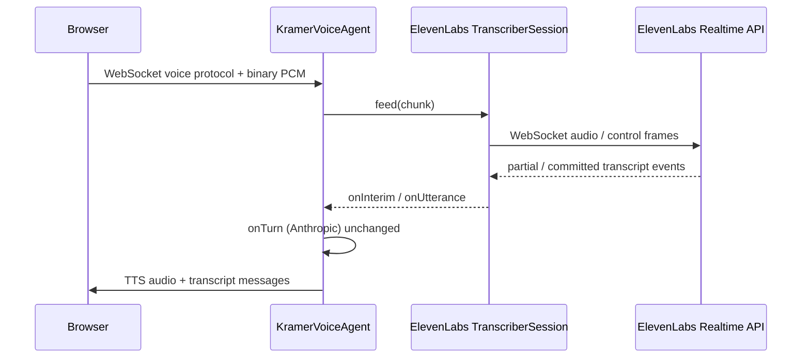

# feat: ElevenLabs Realtime STT for Kramer voice agent

## Overview

Replace **continuous speech-to-text** in the Kramer Moviefone voice pipeline from **Workers AI Flux STT** (`WorkersAIFluxSTT`, `@cf/deepgram/flux`) to **ElevenLabs Scribe Realtime v2** (`scribe_v2_realtime`), while **keeping** the existing **Anthropic** LLM in `onTurn` and **Workers AI TTS** (`WorkersAITTS`) unless product later requests those to change.

**Clarification:** In the current codebase, **Anthropic is not used for speech-to-text**—it only powers streaming text in `onTurn` and seed lines. STT is `WorkersAIFluxSTT`. This plan targets **STT only** unless a follow-up explicitly changes the LLM stack.

## Problem Frame

Workers AI Flux STT is serviceable but the product owner wants **ElevenLabs** realtime transcription (partial + committed transcripts, low latency). The app already uses `@cloudflare/voice` with a pluggable **`Transcriber`** contract (`createSession` → `feed` PCM, `onInterim`, `onUtterance`), so the primary approach is a **server-side** ElevenLabs adapter that preserves `useVoiceAgent` and the existing WebSocket binary audio path.

The **client-side** guide the user provided (`useScribe`, single-use tokens) is relevant for **token minting patterns** and product understanding; **drop-in** use of browser-only Scribe would **bypass** the agent’s mic → DO → `feed()` pipeline and complicate interruption, metrics, and history. The plan therefore treats **Durable Object / worker–side** realtime Scribe (see ElevenLabs “server-side streaming” for the same WebSocket API) as the default integration shape, and lists the **browser Scribe + token route** as an alternative with explicit tradeoffs.

## Requirements Trace

- **R1.** User speech is transcribed by **ElevenLabs Scribe Realtime v2**, with **interim** text surfaced in the UI where the app already shows `interimTranscript` (via `onInterim` → server messages).
- **R2.** **Complete utterances** still drive `onTurn` with stable text (via `onUtterance` / commit semantics aligned with ElevenLabs).
- **R3.** **No ElevenLabs API key** in client bundles; secrets live in **Worker / Durable Object** env (and token route is only needed for the optional client-SDK path).
- **R4.** **Anthropic** usage in `src/agents/kramer-voice-agent.ts` for `streamText` remains behaviorally unchanged unless explicitly scoped out.
- **R5.** **TTS** remains on `WorkersAITTS` unless a separate follow-up migrates TTS (out of scope here; `@cloudflare/voice` already documents `@cloudflare/voice-elevenlabs` for TTS only).

## Scope Boundaries

- **In scope:** Replace `WorkersAIFluxSTT` with an ElevenLabs-backed `Transcriber`; add `ELEVENLABS_API_KEY` (or equivalent) to worker secrets; types and wiring; tests around the adapter and agent configuration.
- **Out of scope:** Replacing Anthropic with another LLM; migrating TTS to ElevenLabs; Twilio/telephony.
- **Non-goals:** Forking `@cloudflare/voice` internals; patching `node_modules`.

## Context & Research

### Relevant Code and Patterns

- **Agent:** `src/agents/kramer-voice-agent.ts` — `transcriber = new WorkersAIFluxSTT(this.env.AI)`; `afterTranscribe`; `onTurn` uses Anthropic.
- **Transcriber contract:** `Transcriber` / `TranscriberSession` in `@cloudflare/voice` — `createSession` receives `onInterim` and `onUtterance`; session accepts **16 kHz mono PCM16 LE** via `feed(ArrayBuffer)` and `close()` at end of call (`node_modules/@cloudflare/voice/dist/types-CvX5a9oH.d.ts`).
- **Client:** `src/routes/index.tsx` — `useVoiceAgent({ agent: "KramerVoiceAgent" })` and `interimTranscript` display; should keep working if server emits the same protocol messages.
- **Config:** `wrangler.jsonc` — `ai` binding retained for TTS (and unused for STT after migration).
- **Prior plan (context only):** `docs/plans/2026-04-22-002-feat-cloudflare-voice-kramer-agent-plan.md` assumed Workers AI STT; this plan supersedes that STT decision.

### Institutional Learnings

- `docs/solutions/` is not present in this repo; no local runbooks to cite.

### External References

- ElevenLabs: **Speech to Text Realtime** API reference (`/docs/api-reference/speech-to-text/v-1-speech-to-text-realtime`) for WebSocket messages, model id `scribe_v2_realtime`, partial vs committed transcripts, and commit strategies.
- ElevenLabs: **Server-side streaming** guide (pair to the user’s client-side guide) for running the same realtime model from a backend without exposing API keys.
- Cloudflare: `@cloudflare/voice` README — `Transcriber` / `createTranscriber`, experimental API warning (pin versions).

## Key Technical Decisions

- **Integration locus (default):** Implement **`Transcriber` + `TranscriberSession`** in the worker that open a **server-side** WebSocket (or supported client) to ElevenLabs Realtime, stream mic PCM from existing `feed()` calls, and map ElevenLabs events to `onInterim` and `onUtterance`. **Rationale:** Preserves `useVoiceAgent`, binary audio transport, `afterTranscribe`, and interruption behavior without duplicating microphone capture.

- **Auth model (default):** Store **`ELEVENLABS_API_KEY`** as a Worker secret and use it from the Durable Object / worker for server-side connections. **Rationale:** Matches “never expose API key to the client”; single-use tokens are primarily for **browser** SDK connections per ElevenLabs docs.

- **Alternative (explicitly secondary):** Browser `@elevenlabs/react` `useScribe` + **`/scribe-token`** route using `ElevenLabsClient.tokens.singleUse.create("realtime_scribe")`. **Rationale for not defaulting:** Requires a second audio path or forwarding transcripts into the agent (e.g. `sendText` / custom messages), duplicating turn detection and breaking the single binary pipeline; only choose if server-side WS is infeasible in Workers.

- **Dependency choice:** Prefer **`@elevenlabs/elevenlabs-js`** only where it helps (e.g. token creation on a route, or official WS helpers if compatible with Workers runtime). If the SDK pulls in Node-only APIs, use **direct `fetch` + WebSocket** per API reference with minimal surface. **Rationale:** Workers compatibility must be validated before locking in a heavy client.

- **Model id:** Use **`scribe_v2_realtime`** per ElevenLabs realtime docs unless a newer id is required by the account; confirm in implementation.

## Open Questions

### Resolved During Planning

- **“Replace Anthropic for STT”:** Misread of the stack—**Anthropic is LLM-only** here; this plan replaces **Workers AI STT**, not Anthropic.

### Deferred to Implementation

- **Exact ElevenLabs wire protocol** (message shapes, auth headers, ping/pong, error codes) — follow current API reference at implementation time; do not hardcode unverified payloads in the plan.
- **Commit / end-of-turn alignment:** Map ElevenLabs “committed” segments to `onUtterance` and ensure double-firing does not duplicate `onTurn` (may require de-duplication vs `afterTranscribe`).
- **SDK vs raw WebSocket** in Workers — spike in dev for bundle size, cold start, and `nodejs_compat` needs.

## High-Level Technical Design

> *This illustrates the intended approach and is directional guidance for review, not implementation specification. The implementing agent should treat it as context, not code to reproduce.*

**Decision matrix (STT path):**

| Input | Outcome |
|--------|---------|
| Default | Server-side ElevenLabs WS in `TranscriberSession` + `ELEVENLABS_API_KEY` in secrets |
| Blocker on server WS from DO | Spike: optional client `useScribe` + token route + explicit bridge to agent (higher risk) |

## Implementation Units

- [x] **Unit 1: Secrets, env typing, and dependencies**

**Goal:** Add `ELEVENLABS_API_KEY` to worker secrets contract and minimal dependencies for ElevenLabs integration.

**Requirements:** R3

**Dependencies:** None

**Files:**

- Modify: `wrangler.jsonc` (only if a new var binding pattern is used; optional comment in plan — secrets often do not need wrangler file changes)
- Modify: `src/env-secrets.d.ts` and/or `worker-configuration.d.ts` (regenerate with `pnpm run cf-typegen` after `vars` if applicable)
- Modify: `package.json` (add `@elevenlabs/elevenlabs-js` and/or client packages **only if** chosen approach requires them in the same bundle)

**Approach:** Document that production uses `wrangler secret put ELEVENLABS_API_KEY` and local dev uses `.dev.vars`. Keep `ANTHROPIC_API_KEY` unchanged. Prefer smallest dependency set compatible with Workers.

**Patterns to follow:** Existing `ANTHROPIC_API_KEY` documentation pattern in `src/env-secrets.d.ts`.

**Test scenarios:**

- **Test expectation: none** — no runtime behavior; verify types compile after `cf-typegen` if types file is touched.

**Verification:** `ELEVENLABS_API_KEY` is referenced only from server-side modules; no accidental import into `src/routes` or client-only chunks.

- [x] **Unit 2: `ElevenLabsRealtimeTranscriber` (or equivalent) — `Transcriber` implementation**

**Goal:** Replace `WorkersAIFluxSTT` with a class implementing `Transcriber` that creates sessions speaking ElevenLabs Realtime.

**Requirements:** R1, R2, R3

**Dependencies:** Unit 1

**Files:**

- Create: `src/agents/elevenlabs-realtime-stt.ts` (name illustrative — single module or split session class per repo taste)
- Test: `src/agents/elevenlabs-realtime-stt.test.ts` (or colocated `*.test.ts` per project convention)

**Approach:** Implement `createSession` returning an object with `feed` and `close` that buffers or streams PCM to ElevenLabs per **server-side** realtime documentation. Map streaming events to `options.onInterim` and `options.onUtterance`. On `close`, tear down WebSocket cleanly. Log and surface errors in a way the voice pipeline can turn into user-visible `error` if needed (follow `@cloudflare/voice` error propagation patterns).

**Execution note:** If the API is large or poorly typed, start with a thin wrapper and expand; avoid `as any` (project rule).

**Patterns to follow:** Behavior mirrors `WorkersAIFluxSTT`’s use of `TranscriberSessionOptions` callbacks (`node_modules/@cloudflare/voice` types).

**Test scenarios:**

- **Happy path (mocked transport):** Simulated partial then committed text → `onInterim` then `onUtterance` called with expected strings.
- **Edge case:** `close()` idempotent or safe if WS already dead; no throw that crashes DO.
- **Error path:** Simulated EL error frame → session handles without leaving dangling listeners.
- **Integration (manual / wrangler dev):** Short spoken phrase produces interim in UI and a single stable turn into `onTurn` — `Verification` only, not automated if too heavy.

**Verification:** Swap-in only this transcriber in a dev build and confirm end-to-end voice call still completes (STT → Kramer reply → TTS).

- [x] **Unit 3: Wire `KramerVoiceAgent` to ElevenLabs transcriber**

**Goal:** Use the new `Transcriber` from the voice agent and remove reliance on `WorkersAIFluxSTT` for this agent.

**Requirements:** R1, R2, R4, R5

**Dependencies:** Unit 2

**Files:**

- Modify: `src/agents/kramer-voice-agent.ts`
- Test: `src/test/kramer-home.test.tsx` and/or new agent-focused test if the project adds one (existing tests mock `useVoiceAgent` — adjust only if agent export or behavior contract changes)

**Approach:** Set `transcriber` to the new class (pass `env` with `ELEVENLABS_API_KEY`). Keep `afterTranscribe` semantics (trim / min length) unchanged. Do **not** change Anthropic or TTS lines unless a compile error forces a type-only fix.

**Patterns to follow:** Existing `KramerVoiceAgent` structure in `kramer-voice-agent.ts`.

**Test scenarios:**

- **Happy path:** `afterTranscribe` still filters noise short lines (if covered indirectly via integration tests; else defer to manual).
- **Error path:** Missing `ELEVENLABS_API_KEY` — predictable degraded behavior (log + error string or same pattern as missing Anthropic; align with product — document chosen behavior in code comments only if non-obvious).

**Verification:** Voice call works in `wrangler dev` with only `ELEVENLABS_API_KEY` and existing secrets present.

- [ ] **Unit 4: Optional token HTTP route (only if browser Scribe path is selected)**

**Goal:** If product chooses **client-side** `useScribe` per ElevenLabs guide, add a **secured** `GET` handler that returns a single-use token JSON.

**Requirements:** R3 (only for this path)

**Dependencies:** Product decision; not required for default server-side adapter.

**Files:**

- Modify: `src/server.ts` or router module (where `fetch` is composed)
- Test: new route test with mocked `ElevenLabsClient`

**Approach:** Use `ElevenLabsClient` with server key; never log full tokens. Add basic abuse control (e.g. same-origin, session cookie, or Cloudflare rate limiting) — **deferred** detail in implementation.

**Test scenarios:**

- **Happy path:** Mock client returns token shape `{ token: string }` or API-documented response.
- **Error path:** Upstream failure returns 502 without leaking key material.

**Verification:** If this unit is **not** selected, skip entirely; default plan does not require it.

## System-Wide Impact

- **Interaction graph:** Voice WebSocket, `useVoiceAgent`, `KramerVoiceAgent` STT path only. LLM (`onTurn`) and TTS paths unchanged in the default design.
- **Error propagation:** ElevenLabs connection failures should surface as library `error` or logs consistent with current UX in `src/routes/index.tsx`.
- **State lifecycle risks:** WebSocket from DO to ElevenLabs must be closed on `end_call` / disconnect to avoid leaking connections or $ spend.
- **API surface parity:** N/A (no new public HTTP API in default path).
- **Unchanged invariants:** `useVoiceAgent` options shape; `interimTranscript` display; Anthropic model id and prompts; `WorkersAITTS` speaker.

## Risks & Dependencies

| Risk | Mitigation |
|------|------------|
| `@cloudflare/voice` is experimental; adapter assumptions may break on upgrade | Pin versions; run smoke tests on `@cloudflare/voice` upgrades |
| ElevenLabs WS protocol or quota errors in production | Structured logging, user-visible “line trouble” copy, retry policy only where API allows |
| Workers bundle / runtime limits with ElevenLabs SDK | Prefer minimal surface; WebSocket in Workers is supported — validate in spike |
| Confusion with Anthropic | Document in PR: STT vendor change only; LLM unchanged |
| Cost / billing | Call out in rollout: ElevenLabs usage is new line item vs Workers AI STT |

## Documentation / Operational Notes

- **Rollout:** Add `ELEVENLABS_API_KEY` to production secrets before deploy; monitor ElevenLabs dashboard for usage spikes after release.
- **Local dev:** Document `.dev.vars` key for contributors (without committing secrets).

## Sources & References

- **User-provided:** ElevenLabs client-side streaming guide (single-use token, `useScribe`, `scribe_v2_realtime`)
- **Related code:** `src/agents/kramer-voice-agent.ts`, `src/routes/index.tsx`, `@cloudflare/voice` type definitions
- **Prior plan:** `docs/plans/2026-04-22-002-feat-cloudflare-voice-kramer-agent-plan.md` (STT choice superseded)
- **External docs:** [Cloudflare Voice agents](https://developers.cloudflare.com/agents/api-reference/voice/), ElevenLabs Speech-to-Text Realtime API reference

## Confidence & Review Notes (planning pass)

- **Depth:** Standard — new external vendor, secrets, and a custom adapter on an experimental library.
- **Reclassified:** Touches **environment variables** and **worker secrets** — treated as Standard with explicit operational notes.
- **Thin local grounding:** No existing ElevenLabs code; wire protocol and SDK/worker fit are **deferred to implementation** spikes rather than guessed here.

---

*Document review: requirements trace covers STT/LLM distinction; scope excludes TTS/LLM migration; implementation units are ordered; test file paths added for the adapter. No absolute paths in file lists.*
