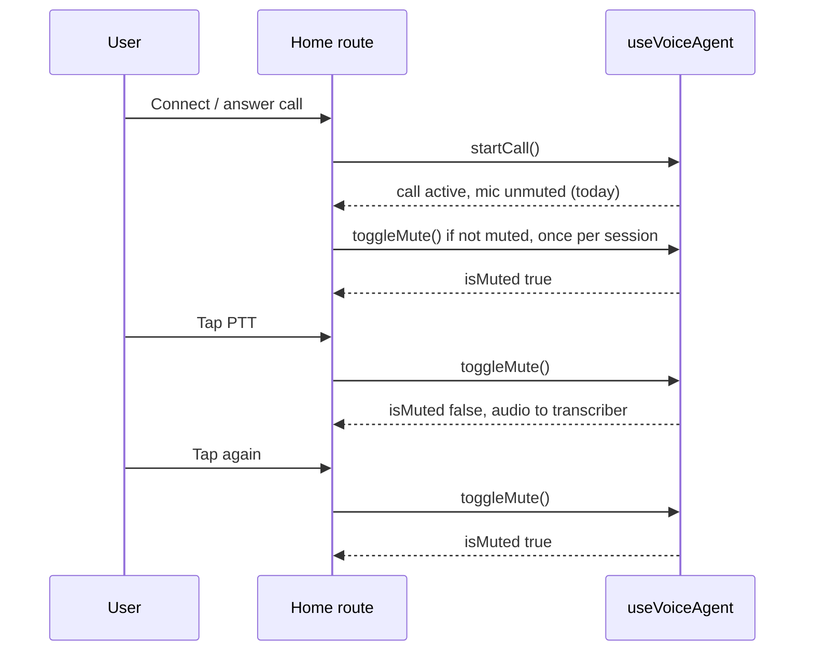

# feat: Push-to-talk (default-muted) mic for Kramer voice call

## Overview

The in-call experience today **opens the mic hot** as soon as `startCall()` runs: the primary in-call control reads **MIC ON — TAP TO MUTE** (`src/routes/index.tsx`), and the idle line prompt says **SPEAK ANY TIME**, which matches **continuous** capture to the transcriber whenever the user is not muted. That picks up **ambient and background noise** and keeps the STT path active. The product direction is **push-to-talk**: the user only transmits when they **choose** (click/tap to open the mic, then click/tap again to stop — **latched** behavior unless you later add press-and-hold). This plan uses the **existing** `toggleMute` / `isMuted` API from `useVoiceAgent` ([Cloudflare Voice React hook](https://developers.cloudflare.com/agents/api-reference/voice/)) and does **not** fork `@cloudflare/voice`.

## Problem Frame

- **User goal:** Reduce always-on room noise and STT from silence by **not** streaming speech-to-text until the user explicitly **opts in** each “turn to speak” (or holds a control, if you add that later).
- **Constraint:** Stay within `@cloudflare/voice`’s public hook — **no** `node_modules` patches; reuse `isMuted` / `toggleMute` semantics (mic muted = not transmitting to the pipeline per hook contract).

## Requirements Trace

- **R1.** After a call session begins (`startCall` has completed for this session), the mic is **muted by default** (`isMuted === true`) so environmental noise is not continuously transcribed.
- **R2.** The user can **unmute and mute** with the existing in-call control (same physical control as today, **relabelled** for push-to-talk). **Latched** “tap to talk / tap to stop” is the default design; true **press-to-hold** (pointer down = unmute, up = mute) is an optional follow-up.
- **R3.** **Status copy** and the **status bar** no longer imply “always listening / speak any time” while the default is muted; they should reflect **MIC OFF** vs **LIVE** (or equivalent retro copy) so users know when audio is going to the agent.
- **R4.** **Hang up** and reconnect behavior stays correct: no stale “initialized mute” state leaking across calls (e.g. use a per-session ref or branch on `callSessionActive` / `endCall`).

## Scope Boundaries

- **In scope:** `src/routes/index.tsx` flow after `startCall`, status string machine, in-call button labels/styling, tests that mock `useVoiceAgent`.
- **Out of scope:** Changing `KramerVoiceAgent`, transcriber, or Durable Object audio handling; custom `getUserMedia` or worklets; forking the Voice client.
- **Non-goals:** Device picker; new env vars; ElevenLabs / STT model changes (see `docs/plans/2026-04-22-004-feat-elevenlabs-realtime-stt-plan.md` as separate track).

## Context & Research

### Relevant Code and Patterns

- `src/routes/index.tsx` — `useVoiceAgent` yields `toggleMute`, `isMuted`, `startCall`, `endCall`, `status` (`idle` | `listening` | `thinking` | `speaking`). In-call block shows mute toggle; `callSessionActive` gates “connected” UI vs ringing.
- Cloudflare docs: `useVoiceAgent` — **`isMuted`** (whether the microphone is muted), **`toggleMute`**, plus optional **tuning** keys (`silenceThreshold`, `silenceDurationMs`, `interruptThreshold`, `interruptChunks`) that affect silence / interrupt behavior when unmuted. Changing tuning reconnects the client (connection key includes them).
- `src/routes/index.test.tsx` — integration-style tests for connect → `startCall` after timers; hang-up calls `endCall`.
- `src/test/kramer-home.test.tsx` — hook wiring smoke tests for `useVoiceAgent`.

### Institutional Learnings

- `docs/solutions/` is not present; none cited.

### External References

- [Cloudflare Agents: Voice API — `useVoiceAgent`](https://developers.cloudflare.com/agents/api-reference/voice/) — return values and tuning table.

## Key Technical Decisions

- **Default mute after `startCall`:** After `await startCall()`, if the session is still **unmuted**, call **`toggleMute()` once** to enter default-muted push-to-talk. **Rationale:** Matches current library default (in-call copy assumes mic starts live). **Guard:** A **one-time-per-call** ref (e.g. `pttArmedRef`) so you do not toggle twice on re-renders; reset on `endCall` / when `callSessionActive` becomes false. If a future `@cloudflare/voice` version defaults to muted, the guard should be **only call when `!isMuted`** so you do not accidentally unmute.
- **Latched PTT (default):** One button cycles muted ↔ unmuted; labels read like **TAP TO SPEAK** / **LIVE — TAP TO STOP** (exact strings TBD in implementation, keep Y2K phone aesthetic). **Rationale:** User asked for “click to talk,” which maps to latch; hold-to-talk is an optional enhancement.
- **Status bar vs `voiceStatus`:** The hook may still report `listening` while the UI conceptually is “line open, mic off.” **Branch display on `isMuted`:** e.g. when `callSessionActive` and `isMuted` and not in `thinking`/`speaking`, prefer **MIC OFF — TAP BUTTON TO SPEAK** over **LISTENING...**; when `!isMuted` and `listening`, show **ON THE AIR** / **LISTENING** as today. **Rationale:** Avoid implying full-duplex hot mic when PTT is armed.
- **Tuning (optional, deferred):** If short unmuted utterances feel “sticky” or interrupt detection misbehaves, pass **`useVoiceAgent({ … silenceThreshold, silenceDurationMs, interruptThreshold, interruptChunks })** — only after manual QA, because options trigger **reconnect**.

## Open Questions

### Resolved During Planning

- **“Must we patch the library?”** No — `toggleMute` + default-mute pass satisfies R1 without custom capture.

### Deferred to Implementation

- **Exact moment `isMuted` is stable after `startCall`:** If a microtask delay is required before `toggleMute` (rare), use `requestAnimationFrame` or `queueMicrotask` once; verify in dev tools, not in the plan.
- **Press-and-hold PTT:** Whether to add `onPointerDown` / `onPointerUp` in addition to latch; product can choose after latch ships.

## High-Level Technical Design

> *This illustrates the intended approach and is directional guidance for review, not implementation specification. The implementing agent should treat it as context, not code to reproduce.*

## Implementation Units

- [x] **Unit 1: Post-start default mute (PTT arm)**

**Goal:** When the call session becomes live, the mic starts **muted** so background noise is not sent by default.

**Requirements:** R1, R4

**Dependencies:** None

**Files:**
- Modify: `src/routes/index.tsx`
- Test: `src/routes/index.test.tsx`

**Approach:**
- In the same async path that runs after mic permission and ringing (where `startCall` is invoked), **await** `startCall()`; then, if one-time guard allows and mic is not intended to be hot, call **`toggleMute()`** when `!isMuted` (read from hook after start). Alternatively: `useEffect` when `callSessionActive && voiceStatus` transitions to first stable post-start — **prefer** a single place to avoid double-toggle; implementer picks the least race-prone option **without** `as any`.
- **Reset** the one-time guard when the user hangs up or the session is torn down so a second call in the same page gets the same behavior.

**Patterns to follow:**
- Existing `handleConnect` / `handleHangUp` / `ringTimeoutRef` patterns in `src/routes/index.tsx`.

**Test scenarios:**
- **Happy path:** After fake timers and successful `startCall` mock, **either** `toggleMute` is invoked to arm PTT **or** the documented behavior is that `isMuted` becomes true (if tests simulate state updates). Align mocks with the chosen implementation so the test proves “session starts muted.”
- **Edge case:** Second connect after hang-up — default mute arms again; no double-toggle from ref bugs.
- **Error path:** If `startCall` fails (mock), do not run PTT arm toggle.

**Verification:**
- Manual: start call, confirm status/button indicate **mic off** until user taps; ambient noise should not create interim text until unmuted.

---

- [x] **Unit 2: In-call and status-line copy (PTT vs live)**

**Goal:** User-visible strings match push-to-talk, not “always on.”

**Requirements:** R3

**Dependencies:** Unit 1

**Files:**
- Modify: `src/routes/index.tsx`
- Test: `src/routes/index.test.tsx` (string assertions if stable), optional snapshot only if the project already uses snapshots (prefer explicit assertions on visible text).

**Approach:**
- Replace **MIC ON — TAP TO MUTE** / **MUTED — UNMUTE** with PTT-oriented copy (e.g. tap to speak / live — tap to stop).
- Extend the `useEffect` that sets `statusText` to branch on **`isMuted`** for `idle` and `listening` (and any other case where “LISTENING” would mislead). Keep **thinking** / **speaking** branches usable when the assistant is replying; ensure **interrupt** hint at bottom of page still makes sense (user may need to be **unmuted** to barge in — if so, that is expected with PTT).

**Patterns to follow:**
- `MIC_STATUS_COPY` and existing status precedence in the same `useEffect`.

**Test scenarios:**
- **Happy path:** When mocked `isMuted` is true and `callSessionActive`, status area shows PTT-appropriate line (assert substring or role).
- **Edge case:** `isMuted` false + `listening` — shows “live” / listening, not “mic off.”

**Verification:**
- Read through full precedence chain (error, mic env, ringing, then PTT branches) for no contradictory labels.

---

- [x] **Unit 3: Test harness and smoke tests**

**Goal:** Mocks and home tests stay consistent with new `startCall` + `toggleMute` sequencing.

**Requirements:** R1–R3

**Dependencies:** Units 1–2

**Files:**
- Modify: `src/routes/index.test.tsx`, `src/test/kramer-home.test.tsx`

**Approach:**
- Extend `useVoiceAgent` mock to expose mutable `isMuted` if tests assert post-toggle state; spy `toggleMute` and `startCall` to assert PTT arm **when** required by Unit 1’s implementation.
- **Avoid** brittle over-counting of `toggleMute` unless the test names the reason (e.g. “initial arm + user tap”).

**Test scenarios:**
- **Integration (mocked):** Connect flow still calls `startCall` once; if Unit 1 uses post-start `toggleMute`, expect the extra call **or** state showing muted — match implementation.
- **Regression:** Prior tests for mic denied / insecure / hang-up still pass.

**Verification:**
- `pnpm test` (or project default) green.

## System-Wide Impact

- **Interaction graph:** Only client `src/routes/index.tsx` and tests; `useVoiceAgent` options may gain tuning later (optional) — that reconnects the socket per docs.
- **Error propagation:** Unchanged; `error` from hook still wins in status bar.
- **State lifecycle risks:** PTT one-shot ref must clear on hang-up; avoid toggling in Strict Mode **double** mount unless guard handles it (implementer verify in React 19 dev).
- **API surface parity:** N/A; no new server routes.
- **Integration coverage:** Full push-to-talk + interrupt + barge-in requires manual or E2E; unit tests use mocks.
- **Unchanged invariants:** `KramerVoiceAgent`, `routeAgentRequest`, `useMicPermission` preflight, wrangler config.

## Risks & Dependencies

| Risk | Mitigation |
|------|------------|
| `toggleMute` timing vs `startCall` async init | Single guarded call after start; verify in dev; optional one-frame delay only if needed |
| User expects barge-in while muted | Status copy notes may need “unmute to interrupt”; document in Verification |
| Tuning options change reconnect | Do not add tuning in same PR unless QA demands it |

## Documentation / Operational Notes

- None required beyond this plan; optional one-line in README only if the team documents operator behavior for demos.

## Sources & References

- **User request (this work):** push-to-talk / click to talk; reduce always-on background noise.
- Related code: `src/routes/index.tsx` (`toggleMute`, `isMuted`, `startCall`)
- Cloudflare docs: [Voice API / useVoiceAgent](https://developers.cloudflare.com/agents/api-reference/voice/)
- Prior context: `docs/plans/2026-04-22-003-feat-microphone-permissions-flow-plan.md` (pre-connect mic UX; orthogonal)
