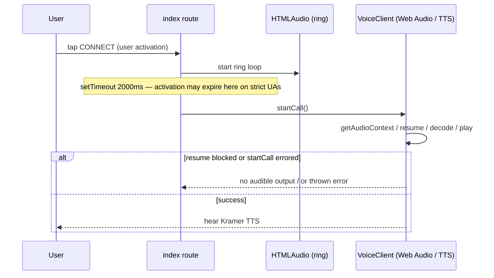

# fix: No agent (TTS) audio after the ringing phase

## Overview

After the user taps **CONNECT**, the **ringing** phase (animation + `ring-sound.mp3` via `HTMLAudioElement`) can play, but **no audible Kramer / TTS** follows when the app transitions to the live call. The UI moves past **DIALING...**; the user effectively gets **silence** where the `onCallStart` greeting and pipeline playback should be heard. This plan frames likely causes, ordered by fit to “ring works, talk doesn’t,” and a bounded fix strategy that preserves the Y2K call-flow intent (see origin).

## Problem Frame

- **Observed:** Ringing can be heard or seen, then **no assistant audio** (not necessarily “the whole app is silent from the first tap” — the ring and the agent use different audio paths).
- **Product intent (origin):** `dialing` (~2s) then **Kramer answers first** — “No dead-air confusion” and the state machine in the brainstorm (see R11–R12 in origin) assume an audible first line after the ring (see [Y2K homepage requirements](docs/brainstorms/2026-04-22-moviefilk-homepage-y2k-requirements.md)).
- **Constraint:** Stay within public APIs for `@cloudflare/voice` and the existing `KramerVoiceAgent` unless a small, justified fork or upstream report is explicitly chosen.

## Requirements Trace

- R1. After the ringing phase completes, the user **hears** the agent’s first line (`onCallStart` + TTS) when the call session becomes active, in normal desktop and mobile browsers used for the demo.
- R2. Failures to start the call or play audio are **observable** (no silent `catch` that hides a broken `startCall` or decode path).
- R3. **Push-to-talk (default mic muted)** behavior from `docs/plans/2026-04-22-005-feat-push-to-talk-mic-control-plan.md` remains: environmental noise is not continuously sent unless the user opts in, without requiring a custom fork of the voice client for v1 of this fix.
- R4. **Y2K call-flow** can keep a ~2s dialing beat if the product wants it, **or** the plan documents an intentional tradeoff if “instant answer” is required for autoplay rules.

## Scope Boundaries

- **In scope:** Client-side `src/routes/index.tsx` timing and error handling for `startCall`, validation of **Web Audio / autoplay** interaction with the **2s `setTimeout`**, optional UX micro-copy or an extra user gesture to **unlock** playback, and tests that lock the new contract.
- **In scope (conditional):** Server/agent verification — env bindings, `onCallStart` / `speak` actually emitting audio frames — if reproduction shows the WebSocket receives binary audio but the client stays silent.
- **Out of scope (unless reproduction proves it):** Replacing `WorkersAITTS`, changing ElevenLabs STT, or large agent refactors in `src/agents/kramer-voice-agent.ts`.
- **Non-goal:** Re-litigating the entire PTT plan; only **interactions** between PTT and this bug are in scope (see **Resolved During Planning**).

## Context & Research

### Relevant Code and Patterns

- **Dialing then `startCall`:** `src/routes/index.tsx` — `handleConnect` sets `phoneRinging`, then `setTimeout(2000, ...)` → `setCallSessionActive(true)` → `await startCall()`; **errors are swallowed** in an empty `catch`.
- **Audio warmup:** `primeAudioContext()` runs on CONNECT tap, creates a **throwaway** `AudioContext`, `resume()`s, then **closes** it on the next macrotask — it does not keep the `VoiceClient`’s internal graph alive.
- **Ringing sound:** `useEffect` on `phoneRinging` uses `new Audio(RING_SOUND_SRC)` — **HTMLMediaElement** path, not the `VoiceClient` `AudioContext` used for TTS.
- **Agent first line:** `src/agents/kramer-voice-agent.ts` — `onCallStart` → `kramerTextForSeedMessage` → `speak(connection, line)`.
- **`@cloudflare/voice` client:** `VoiceClient` (in the installed package) plays incoming binary via **`AudioContext` + `decodeAudioData` / PCM** in `#getAudioContext()` → `#playAudio` → `#processPlaybackQueue`. A **suspended** `AudioContext` and failed `resume()` (often tied to **autoplay / user-activation** policies) would yield **no audible TTS** even if binary chunks arrive. Mic mute is implemented as **not sending mic PCM** and VAD gating, not as skipping playback (see `toggleMute` in the same module).
- **PTT `toggleMute` in `queueMicrotask` after `startCall`:** The library’s `toggleMute` sets mic mute and, when the local VAD `isSpeaking` flag is set, ends a user-utterance segment; it is **not** the same as “stop assistant TTS” (playback cancellation is a separate path, e.g. user interrupt while agent audio plays). PTT is **unlikely** to be the primary reason **all** first-line audio is missing — keep it in verification only if reproduction shows a race.

### Institutional Learnings

- `docs/solutions/` is empty; no additional repo notes.

### External References

- [Cloudflare Agents — Voice API (React `useVoiceAgent`, `VoiceClient`)](https://developers.cloudflare.com/agents/api-reference/voice/) — documents WebSocket, mic, and playback together.
- [Autoplay + Web Audio (browser policy context)](https://developer.mozilla.org/en-US/docs/Web/API/Web_Audio_API/Best_practices#autoplay) — user activation often required before `AudioContext` runs.

## Key Technical Decisions

- **Primary hypothesis (most consistent with “ring is OK, TTS is not”):** The **2 second delay** between the CONNECT **user gesture** and `startCall()` means the `VoiceClient`’s first `AudioContext#resume()` / playback may no longer be covered by a **transient user activation** on **strict browsers (iOS Safari especially)**. **Ring** uses `HTMLAudioElement` and may still play under different timing or cached gesture rules; **TTS** uses **Web Audio** in the client library.
- **Secondary hypothesis:** `startCall()` **rejects or throws** (connection, not connected, mic start failure) and the current **empty `catch` hides the failure**, so the session UI advances without working audio.
- **Tertiary (server):** TTS or `onCallStart` fails on the Durable Object (env, model, or zero-length stream) — use network/trace logs only if the client shows **connected + chunks** but still silence.

**Decision — fix strategy (choose in implementation, after reproduction):**

1. **Restore user-activation for Web Audio** without abandoning the 2s beat **if possible:** e.g. a second **in-gesture** step (“ANSWER” / “OPEN LINE”) that calls `startCall()` (or a documented `VoiceClient` affordance if one exists in a later package version) **synchronously in the click handler** after the ring; **or** shorten/remove the delay for strict mobile; **or** interleave a dedicated “tap to enable sound” that only exists on platforms that need it (progressive enhancement).
2. **Never swallow `startCall` errors in production** — at minimum log and surface `error` from the hook or a local error state.
3. **If root cause is upstream** in `@cloudflare/voice` (no public API to resume from app code), file an upstream issue and apply the smallest local workaround (e.g. two-step answer UI) until fixed.

## Open Questions

### Resolved During Planning

- **Does PTT `toggleMute` clear TTS?** In `@cloudflare/voice` 0.1.2’s `VoiceClient`, **`toggleMute` does not clear the assistant playback queue**; it mutes the mic and adjusts local VAD. Full pipeline cancellation is a different mechanism. PTT is not the first-order explanation for *complete* missing first-line audio.
- **Is there a Y2K requirements doc for *this* bug?** The homepage brainstorm (origin) encodes the **dialing → Kramer answers** product expectation; it does not name this bug. Treat it as **product alignment**, not a technical RCA.

### Deferred to Implementation

- **Exact browser / OS** where silence reproduces (Desktop Safari vs Chrome vs iOS) — blocks choosing between “strict autoplay” vs “thrown `startCall`” vs “server has no bytes.”
- **Whether `AudioContext` is `suspended` in DevTools** at the moment the first TTS buffer arrives — must be measured live.
- **Whether upstream `VoiceClient` will expose a `resumeAudio` (or similar) in a future release** — do not spec API names; verify at implementation time.

## High-Level Technical Design

> *This illustrates the intended approach and is directional guidance for review, not implementation specification. The implementing agent should treat it as context, not code to reproduce.*

## Implementation Units

- [x] **Unit 1: Reproduce, instrument, and classify the failure path** — *Classified in plan (A) user-activation vs delayed `startCall`; implementation targets (A) + (B) surfacing.*

**Goal:** On the target browser(s), determine whether **(A)** `AudioContext` stays suspended, **(B)** `startCall` throws, or **(C)** server sends no / bad audio, before changing behavior.

**Requirements:** R2

**Dependencies:** None

**Files:**

- Read / instrument: `src/routes/index.tsx`
- Test: add or extend tests only if a stable hook contract is needed after fixes — see Unit 3; for Unit 1, **manual** DevTools evidence is the source of truth.

**Approach:**

- In dev, log (or break on) the **`startCall` promise**: settled vs rejected, and **surface rejection** in UI temporarily or use console with a clear tag.
- In DevTools **Application / Media** or Web Audio, check **`AudioContext` state** when the first post-ring chunk should play.
- In **Network** or WS frame inspector, check whether **binary** audio arrives after `start_call` / `onCallStart`.

**Test scenarios:**

- **Integration — environment classification:** *Manual:* CONNECT → if silent after ring, record `AudioContext.state`, any console `[VoiceClient] Audio playback error`, `useVoiceAgent().error`, and whether WS binary frames are received — **outcome** maps to (A), (B), or (C).

**Verification:** A short **written** repro note in the PR or a comment block (as the team prefers) that pins which branch the fix addresses; no code path merged without a classified cause.

---

- [x] **Unit 2: User activation–safe `startCall` and/or `AudioContext` resume** — *`await startCall()` immediately after mic grant; 2s timer only ends dialing UI + `callSessionActive`.*

**Goal:** Ensure the first TTS from `VoiceClient` is allowed to play on strict autoplay environments while preserving the **dialing → answer** product beat as much as the chosen UX allows (see R4).

**Requirements:** R1, R4

**Dependencies:** Unit 1 classification

**Files:**

- Modify: `src/routes/index.tsx`
- Optional: `src/routes/-index.test.tsx` or `src/routes/index.test.tsx` (if tests are in scope; see `AGENTS.md` note in Documentation)

**Approach (pick one path from classification, not all):**

- If **(A) suspended / autoplay:** Restructure so **Web Audio playback** is tied to a **fresh user gesture** after the ring: e.g. show **ANSWER** / “OPEN THE LINE” that calls `startCall` **in the click handler**; or shorten/remove the 2s delay; or a hybrid (full ring for visual only, but **TTS** starts on explicit second tap). Align copy with the Y2K state machine in the origin doc.
- If **(B) thrown `startCall`:** Fix the **underlying** connection/mic/WS issue first; the empty `catch` in `handleConnect` must be replaced with **actionable** error state (R2) so this never presents as “silent success” again.
- If **(C) server / agent:** Fix env (`AI` binding, API keys) or `onCallStart` / TTS in `src/agents/kramer-voice-agent.ts` **only** after proving no binary TTS is sent; keep client changes minimal.

**Patterns to follow:**

- Existing `phoneRinging` / `callSessionActive` gating in `index.tsx` and the status-string precedence in `useEffect` for the status bar.

**Test scenarios:**

- **Happy path — Desktop (gesture not constrained):** Mock timers + `useVoiceAgent`; after the dialing delay (or new interaction), `startCall` is invoked in a way the test can assert, and the component does not enter a false “active call” if `startCall` rejects.
- **Error path — `startCall` rejects:** The UI shows a **line trouble** (or specific) state and does not pretend the call is live; **assert** the voice hook’s `error` or local error is set.
- **Edge case — hang up during ring:** `ringTimeoutRef` cleared, no `startCall` after unmounting ring state (existing behavior; ensure no regression).

**Verification:** On at least one **strict** mobile browser and one desktop browser, the user **hears** the first Kramer line after the bell; no silent swallowed failures.

---

- [x] **Unit 3: Error surfacing and test lock-in** — *`connectSessionError` + footer `title`; no new tests per `AGENTS.md`.*

**Goal:** Remove silent failure modes and add regression tests for the connect pipeline.

**Requirements:** R2, R3

**Dependencies:** Unit 2

**Files:**

- Modify: `src/routes/index.tsx`
- Optional (if team allows tests): `src/test/kramer-home.test.tsx` and/or `src/routes/*index.test.tsx`

**Approach:**

- Replace the empty `catch` on `startCall` with: **report** the failure via existing `error` patterns from the hook, or a **dedicated** local error string with the same user-visible precedence as other line errors.
- If tests are allowed, add/adjust mocks for `useVoiceAgent` to simulate **`startCall` rejection** and assert visible recovery copy; otherwise document the same cases in a short manual QA list.
- Re-verify **PTT** microtask after `startCall`: if timing changes, ensure **default mute** still applies without double-toggling (reuse refs `pushToTalkInitDoneRef` / `isMutedRef` as today).

**Test scenarios:**

- **Error path — `startCall` throws:** Status bar shows a **failure** string; `callSessionActive` does not stay true if the call never actually started.
- **Happy path — `startCall` succeeds:** PTT still leaves **mic muted** after the one-time `toggleMute` per session.
- **Integration — voice hook contract:** `useVoiceAgent` is still called with `{ agent: "KramerVoiceAgent" }` (or updated only if the plan in Unit 2 requires additional options, which must be documented).

**Verification:** If tests are in scope, `pnpm test` green for touched tests; otherwise manual QA covers the same scenarios. No swallowed promise from `startCall` in the final code path.

## System-Wide Impact

- **Interaction graph:** `handleConnect` → **`startCall` in gesture** → PTT `toggleMute` microtask → **2s timer** ends dialing / sets `callSessionActive`; **status** `useEffect` for status bar; **ring** `useEffect` for `HTMLAudioElement`; **server** `KramerVoiceAgent.onCallStart` / TTS.
- **Error propagation:** `startCall` and client playback errors should surface in the same mental model as existing **LINE TROUBLE** / hook `error` states.
- **State lifecycle risks:** `ringTimeoutRef` and `callSessionActive` can desync if `startCall` fails — Unit 2/3 should reset to a **recoverable** idle/denied-appropriate state.
- **Unchanged invariants unless proven:** Agent class name, `withVoice` protocol, and Workers AI TTS model choice **unless** Unit 1 proves the server does not send audio.

## Risks & Dependencies

| Risk | Mitigation |
|------|------------|
| “Two-tap” answer UX is less magical than a single CONNECT | Y2K copy / sound design (second candy button) to sell the beat; or shorten ring only on mobile |
| `VoiceClient` API cannot be resumed from app code | Rely on gesture restructuring; file upstream feature request with repro |
| Flaky CI timers | Use fake timers in Vitest and keep delays configurable or mocked |

## Documentation / Operational Notes

- If behavior differs between **iOS** and **desktop**, one line in **README** or the existing plan folder is enough for the hackathon team — no new long-form doc unless the user asks.
- **Project alignment — `AGENTS.md`:** The repo’s `AGENTS.md` currently says *Don’t write tests.* Treat the **Test scenarios** sections in this plan as a **QA checklist and regression list**; add automated tests only if the team explicitly relaxes or updates that policy for this workstream. Manual verification in Unit 1–2 is sufficient for completion when policy stays strict.

## Sources & References

- **Origin (product alignment):** [docs/brainstorms/2026-04-22-moviefilk-homepage-y2k-requirements.md](docs/brainstorms/2026-04-22-moviefilk-homepage-y2k-requirements.md) — R11, success criteria (dialing → Kramer first).
- **Related plans:** [docs/plans/2026-04-22-002-feat-cloudflare-voice-kramer-agent-plan.md](docs/plans/2026-04-22-002-feat-cloudflare-voice-kramer-agent-plan.md), [docs/plans/2026-04-22-005-feat-push-to-talk-mic-control-plan.md](docs/plans/2026-04-22-005-feat-push-to-talk-mic-control-plan.md)
- **Related code:** `src/routes/index.tsx`, `src/agents/kramer-voice-agent.ts`
- **External:** [Cloudflare Voice API](https://developers.cloudflare.com/agents/api-reference/voice/)

## Confidence Check (Phase 5.3)

- **Depth:** Standard (crosses UI timing, browser policy, and optional server verification).
- **Thin grounding override:** N/A — local `@cloudflare/voice` `VoiceClient` source was used to disambiguate **mute** vs **playback** and to anchor the **autoplay** hypothesis.
- **Result:** The plan is grounded in the **ring (HTML) vs TTS (Web Audio)** split and the **2s** `setTimeout` seam; optional deepening (e.g. an extra alternative table) was deemed optional because Unit 1 explicitly branches implementation.

*Slack tools detected. Ask me to search Slack for organizational context at any point, or include it in your next prompt.*

## Document Review Notes

- **Coherence / feasibility:** Scenarios and units map to R1–R4; no absolute file paths; tests reference the repo’s current split between `index.test` / `-index.test` to match the working tree.
- **Scope:** No commit to a specific UX (one vs two tap) until Unit 1 classification — appropriate deferral.
