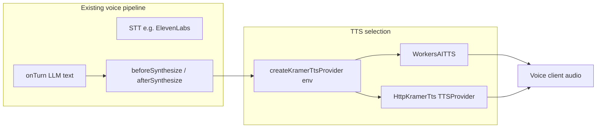

# feat: Swappable Kramer TTS (Workers AI vs remote audio endpoint)

## Overview

Add a **pluggable TTS path** to the existing `KramerVoiceAgent` so synthesized speech can come from **either** the current **Workers AI TTS** (`WorkersAITTS` + Deepgram Aura) **or** a **separate HTTP “audio model” service** that accepts text and returns Kramer-voice audio (buffered and/or streaming). Configuration chooses the backend **without** duplicating the rest of the voice pipeline (STT, `onTurn`, `beforeSynthesize`, `useVoiceAgent` client).

## Problem Frame

- **Today:** `src/agents/kramer-voice-agent.ts` sets `tts = new WorkersAITTS(this.env.AI, { speaker: "asteria" })`. That locks acoustic output to Workers AI.
- **Goal:** Use a **dedicated endpoint** (your own service or a hosted “audio model” API) that turns **post-LLM text** into Kramer-sounding audio, with **low-friction switching** between built-in and remote synthesis for demos, A/B, and hackathon iteration.
- **Clarification (scope):** This plan is about **where text is turned into audio** (TTS). **Where dialogue text is produced** (e.g. OpenAI in `kramerTextStream`) is a **separate knob**; the plan calls out an optional follow-up if you want both LLM and TTS behind configurable providers.

## Requirements Trace

- **R1.** The agent can send **synthesis text** (after `beforeSynthesize`) to **Workers AI TTS** or to a **configured remote TTS URL**, selectable by configuration.
- **R2.** Remote path supports at least **non-streaming** audio (`synthesize` → `ArrayBuffer`); if the service supports **chunked/streaming** audio, the agent should expose **streaming TTS** via `synthesizeStream` to preserve low latency (per `@cloudflare/voice` contract).
- **R3.** Switching does not fork `withVoice` or break `transcriber`, `onTurn`, or client `useVoiceAgent` unless explicitly required.
- **R4.** Secrets and URLs for the remote service live in **Worker env** (and local `.dev.vars`), not in client bundles.
- **R5.** Failure modes (HTTP errors, wrong content-type, empty body) are handled without wedging the call; align with existing error-handling style in the agent.

## Scope Boundaries

- **In scope:** TTS provider abstraction, env-based selection, HTTP client to remote TTS, optional streaming, `wrangler` / `Env` typing updates, and wiring in `KramerVoiceAgent`.
- **Out of scope:** Implementing the actual remote Kramer “audio model” server, training, or voice licensing; changing ElevenLabs **STT** unless a binding conflict forces it.
- **Out of scope (unless pulled in by a follow-up plan):** Swapping the **LLM** that generates Kramer *text* (still `streamText` + OpenAI in `onTurn` today).
- **Non-goal:** Replacing `beforeSynthesize` / `afterSynthesize` hooks; they continue to apply regardless of TTS backend.

## Context & Research

### Relevant Code and Patterns

- **Current agent:** `src/agents/kramer-voice-agent.ts` — `withVoice(Agent)`, `transcriber`, `tts = new WorkersAITTS(...)`, `onTurn` streaming text from OpenAI, `onCallStart` + `speak`.
- **Worker entry:** `src/server.ts` — `routeAgentRequest` + TanStack Start.
- **Prior architecture:** [docs/plans/2026-04-22-002-feat-cloudflare-voice-kramer-agent-plan.md](docs/plans/2026-04-22-002-feat-cloudflare-voice-kramer-agent-plan.md) — R3 and “optional third-party TTS” (ElevenLabs mentioned as a stretch; this plan generalizes to **any HTTP backend** you control or integrate).

### Institutional Learnings

- None in `docs/solutions/` for this repo.

### External References

- Cloudflare Voice: `withVoice` requires a **`tts` property of type `TTSProvider`**. The same surface supports **overriding** `synthesize` / `synthesizeStream` for custom providers; official examples show **ElevenLabs** via `synthesize` + `synthesizeStream` ([Agents voice docs / experimental voice notes](https://developers.cloudflare.com/agents/)). Prefer **one** integration style: either a **dedicated `TTSProvider` class** used as `this.tts = …`, or **method overrides** that delegate to a helper — not both in conflicting ways. If the mixin prefers `this.tts` when present, keep **Workers AI** and **remote** as two implementations behind a small **factory** and assign **one** `tts` in the agent.

## Key Technical Decisions

- **Factory-selected `TTSProvider`:** Add something like `createKramerTtsProvider(env: Env): TTSProvider` (name may differ) that returns `new WorkersAITTS(...)` or `new HttpKramerTts({ ... })` based on env. Rationale: single assignment to `tts`, matches existing pattern, testable in isolation, no duplicate `synthesize` logic in the agent class.
- **Remote contract (directional):** Default to **POST** to a base URL with **JSON body** `{ "text": string }` (or a configurable field name via env) and **response** `audio/*` (e.g. `audio/mpeg` or `audio/pcm`) as full body or readable stream. Final path/query/body schema is **deferred to implementation** once the real endpoint is fixed; the plan treats “contract” as an implementation-time dependency with a short ADR in code comments.
- **Streaming vs buffer:** If the remote API returns a **raw stream**, implement `synthesizeStream` with `for await` over `response.body` chunks (respecting the framing the service uses). If it only returns a **full file**, implement `synthesize` and omit streaming or **simulate** stream by chunking the buffer in small slices (only if the voice client benefits — prefer native streaming from the service when available).
- **Auth:** Optional `Authorization: Bearer` or `x-api-key` from env; never hardcode.
- **LLM vs TTS:** Keep OpenAI (or future LLM) configuration **separate** from TTS env to avoid conflating “text generation” and “audio synthesis” switches.

## Open Questions

### Resolved During Planning

- **“Switch where text is sent and returned”:** For TTS, **in** = sanitized line / sentence chunks from the voice pipeline to `TTSProvider`; **out** = PCM/encoded audio to the client. For LLM, **in** = user transcript + history; **out** = assistant text — treat as a different axis unless product asks to unify.
- **Does `@cloudflare/voice` need both `tts` and override methods?** Use **only** the `tts` field with a pluggable provider implementation to avoid precedence ambiguity between property and overridden methods.

### Deferred to Implementation

- **Exact remote API** (path, JSON shape, whether WebSocket, SSE, or single POST).
- **Audio format** expected by the voice client (sample rate, codec) — must match what `@cloudflare/voice` expects from `TTSProvider` for Workers AI parity; consult package types or README when the remote format differs (may need transcoding; out of scope unless minimal).

## High-Level Technical Design

> *This illustrates the intended approach and is directional guidance for review, not implementation specification. The implementing agent should treat it as context, not code to reproduce.*

## Implementation Units

- [ ] **Unit 1: Environment contract and typing**

**Goal:** Define stable env keys and document them for local and deployed Workers.

**Requirements:** R4

**Dependencies:** None

**Files:**

- Modify: `wrangler.jsonc` (or secrets documentation in comments if vars are secret-only)
- Modify: `worker-configuration.d.ts` (generated or hand-updated per repo convention after `cf-typegen`)
- Test: _none per repo_ — see **Verification** (repo [AGENTS.md](AGENTS.md) defers automated tests)

**Approach:**

- Add vars such as `KRAMER_TTS_BACKEND` = `workers` | `http` (string union in types) and, when `http`, `KRAMER_TTS_URL` plus optional `KRAMER_TTS_API_KEY` or header name.
- Run `pnpm run cf-typegen` after `wrangler` changes so `Env` is accurate.

**Test scenarios:**

- **Manual / config:** With `KRAMER_TTS_BACKEND=workers` and no HTTP URL, worker boots and existing behavior unchanged.
- **Manual / config:** With `KRAMER_TTS_BACKEND=http` and a valid `KRAMER_TTS_URL`, agent initializes without throw at class load; invalid combo surfaces a clear log or error at first synthesis (deferred: exact error surface).

**Verification:**

- `Env` typecheck passes; no missing binding errors in dev.

- [ ] **Unit 2: `HttpKramerTts` (or equivalent) `TTSProvider`**

**Goal:** Encapsulate `fetch` to the remote audio endpoint in a class that satisfies the `TTSProvider` interface used by `@cloudflare/voice` (match `WorkersAITTS` method names and return types: `synthesize`, and `synthesizeStream` if supported).

**Requirements:** R1, R2, R5

**Dependencies:** Unit 1

**Files:**

- Create: e.g. `src/agents/http-kramer-tts.ts` (name may differ; keep under `src/agents/`)
- Test: [AGENTS.md](AGENTS.md) — **Test expectation: none —** repo policy defers new automated tests; use manual checklist in Verification.

**Approach:**

- Input: configuration object (base URL, optional auth, timeouts).
- `synthesize(text)`: `POST` text, `await arrayBuffer()`.
- `synthesizeStream(text)`: if the remote API is streaming, return an async generator over `ArrayBuffer` chunks; if not, **omit** or document “not supported” and rely on `synthesize` only (library may fall back — confirm against `@cloudflare/voice` behavior).
- Map HTTP 4xx/5xx to thrown errors or `null` per what `TTSProvider` allows; do not return partial garbage audio.

**Patterns to follow:**

- Same module style as `elevenlabs-realtime-stt.ts` (clear constructor config, no `as any`).

**Test scenarios:**

- **Happy path (manual or integration against mock):** Small JSON/text POST returns a short valid audio body; playback on client works end-to-end.
- **Error path:** Remote returns 500; call fails gracefully; user can retry or hear fallback per product choice (may be “silence + log” if no product spec — document in implementation).
- **Edge case:** Empty string after `beforeSynthesize` — align with current pipeline (skip or no-op).

**Verification:**

- With a stub HTTP server (e.g. local `wrangler` dev + mock route or external mock), TTS path returns bytes of expected `Content-Type`.

- [ ] **Unit 3: `createKramerTtsProvider` and agent wiring**

**Goal:** Select provider from env and assign to `KramerVoiceAgent.tts` (replace direct `new WorkersAITTS` construction).

**Requirements:** R1, R3

**Dependencies:** Unit 2

**Files:**

- Create: e.g. `src/agents/kramer-tts-factory.ts` (optional; or colocate in `kramer-voice-agent.ts` if small)
- Modify: `src/agents/kramer-voice-agent.ts`

**Approach:**

- If `KRAMER_TTS_BACKEND` is `workers` (or unset default), return `new WorkersAITTS(this.env.AI, { speaker: "asteria" })` (preserve current default speaker unless env adds `WORKERS_TTS_SPEAKER`).
- If `http`, return `new HttpKramerTts({ ... })` with URL from env.
- Ensure **one** code path** sets `tts` — e.g. `tts = createKramerTtsProvider(this.env)` in the class field initializer or constructor-like pattern valid for Agents.

**Test scenarios:**

- **Switching:** Toggle only env between runs — same agent code, different audio source; no client diff.
- **Integration:** `speak` in `onCallStart` and a normal `onTurn` reply both use the selected provider.

**Verification:**

- Greeting after connect and a mid-call reply both play when backend is `workers`.
- With HTTP mock, same flow produces audio from mock when backend is `http`.

- [ ] **Unit 4: Developer documentation touchpoint (in-repo, minimal)**

**Goal:** So the next developer knows how to point at a Kramer audio endpoint without reading source.

**Requirements:** R4 (operational clarity)

**Dependencies:** Unit 1–3

**Files:**

- Modify: [README](README.md) or [AGENTS.md](AGENTS.md) — **one** short subsection listing env vars; avoid a new doc unless the team prefers README.

**Approach:** Table: variable name, purpose, `workers` vs `http` need.

**Test scenarios:**

- **Test expectation: none** — documentation-only.

**Verification:**

- A fresh reader can set `.dev.vars` and run `pnpm dev` with HTTP TTS.

## System-Wide Impact

- **Interaction graph:** Only `KramerVoiceAgent` TTS and env; `src/routes/index.tsx` unchanged unless it reads new public config (it should not).
- **Error propagation:** HTTP TTS errors surface during synthesis; ensure they do not crash the DO; log with enough context to debug.
- **State lifecycle risks:** Reuse a single `fetch` per utterance; no global audio buffer in module scope.
- **API surface parity:** N/A — worker-internal.
- **Integration coverage:** End-to-end voice call with each backend; streaming mode if `synthesizeStream` is implemented.
- **Unchanged invariants:** STT, `onTurn` text generation, `beforeSynthesize` / `afterSynthesize` semantics stay the same; only the **audio synthesis backend** changes.

## Risks & Dependencies

| Risk | Mitigation |
|------|------------|
| Remote TTS adds latency or Worker subrequest limits | Timeouts, chunk streaming, keep Workers AI as default for snappy demos |
| Response codec mismatch with what the voice client expects | Document required format; add transcoding only if necessary and measured |
| Ambiguity in `TTSProvider` method precedence | Use factory + single `tts` assignment only; verify against `@cloudflare/voice` version in this repo |

## Documentation / Operational Notes

- List new env vars in README or [AGENTS.md](AGENTS.md); for production, set secrets in the Cloudflare dashboard.
- **Repo [AGENTS.md](AGENTS.md):** “Don’t write tests” — this plan uses **manual verification** scenarios instead of mandating new Vitest files.

## Sources & References

- **Origin / prior plan:** [docs/plans/2026-04-22-002-feat-cloudflare-voice-kramer-agent-plan.md](docs/plans/2026-04-22-002-feat-cloudflare-voice-kramer-agent-plan.md)
- **Product context:** [docs/brainstorms/2026-04-22-moviefilk-homepage-y2k-requirements.md](docs/brainstorms/2026-04-22-moviefilk-homepage-y2k-requirements.md) (Kramer voice quality as key demo lever)
- **Code:** `src/agents/kramer-voice-agent.ts`, `src/server.ts`
- **External:** Cloudflare Agents + Voice (`TTSProvider`, `synthesize` / `synthesizeStream` patterns)
